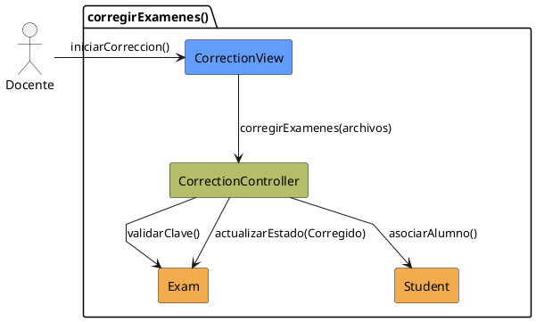
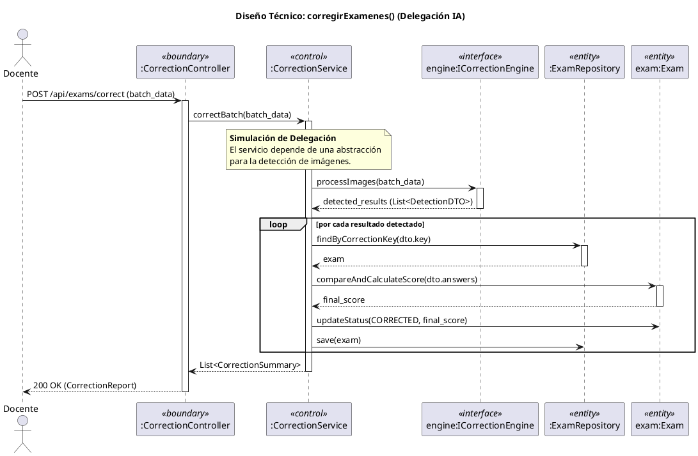

# Jorgestor > CU-01-corregirExamenes > Análisis

> |[🏠️](/Jorgestor/RUP/README.md)|[ 📊](#)|[Detalle](/Jorgestor/RUP/00-casos-uso/02-detalle/CU-01-corregirExamenes/README.md)|**Análisis**|Diseño|Desarrollo|Pruebas|
> |-|-|-|-|-|-|-|

## información del artefacto

- **Proyecto**: Jorgestor
- **Fase RUP**: Elaboration (Elaboración)
- **Disciplina**: Análisis
- **Versión**: 1.0
- **Fecha**: 2026-05-24
- **Autor**: Equipo de desarrollo

## propósito

Análisis tecnológico agnóstico del caso de uso Corregir Exámenes, siguiendo la metodología RUP. Permite analizar el flujo y la validación de corrección de exámenes de los alumnos.

## diagrama de colaboración

||
|-|
|Código fuente: [colaboracion.puml](colaboracion.puml)|

## realización de diseño (secuencia)

||
|-|
|Código fuente: [secuencia.puml](secuencia.puml)|

## clases de análisis identificadas

### clases model (naranja #F2AC4E)
|Clase|Responsabilidad|Trazabilidad|
|-|-|-|
|**Exam**|Representa el examen en el sistema, conteniendo la Clave de Corrección y el estado (Corregido/Pendiente)|Modelo del dominio|
|**Student**|Asocia la corrección al alumno correspondiente mediante la clave|Modelo del dominio|

### clases view (azul #629EF9)
|Clase|Responsabilidad|Derivación|
|-|-|-|
|**CorrectionView**|Interfaz que permite solicitar inicio, introducir exámenes, confirmar, y ver estado|Wireframe|

### clases controller (verde #b5bd68)
|Clase|Responsabilidad|Caso de uso|
|-|-|-|
|**CorrectionController**|Gestiona el flujo de la corrección, valida datos y actualiza estados|corregirExamenes()|

## mensajes de colaboración

|Origen|Destino|Mensaje|Intención|
|-|-|-|-|
|**Docente**|**CorrectionView**|`iniciarCorreccion()`|Solicitar el inicio de la corrección|
|**CorrectionView**|**CorrectionController**|`corregirExamenes(archivos)`|Delegar la lógica de corrección|
|**CorrectionController**|**Exam**|`validarClave()`|Validar clave de corrección del examen|
|**CorrectionController**|**Student**|`asociarAlumno()`|Asociar el examen corregido al alumno|
|**CorrectionController**|**Exam**|`actualizarEstado(Corregido)`|Actualizar estado del examen a corregido|

## trazabilidad con artefactos previos

### con especificación detallada
- **Estados internos** → `RequiringCorrection`, `ProvidingDoneExams`, `ProvidingConfirmation`

