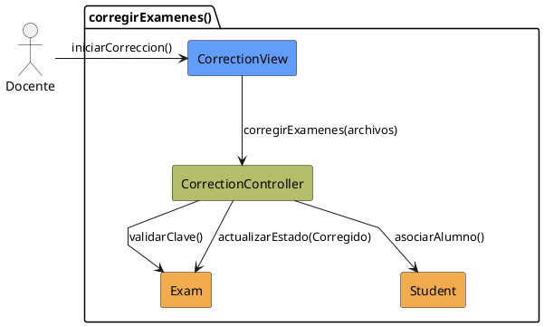

# Jorgestor > CU-01-corregirExamenes > Análisis

## información del artefacto

- **Proyecto**: Jorgestor
- **Fase RUP**: Elaboration (Elaboración)
- **Disciplina**: Análisis
- **Versión**: 1.0
- **Fecha**: 2026-05-24
- **Autor**: Equipo de desarrollo

## propósito

Análisis tecnológico agnóstico del caso de uso Corregir Exámenes, siguiendo la metodología RUP. Permite analizar el flujo y la validación de corrección de exámenes de los alumnos.

## diagrama de colaboración

||
|-|
|Código fuente: [analisis-colaboracion-CU-01-corregirExamenes.puml](analisis-colaboracion-CU-01-corregirExamenes.puml)|

## realización de diseño (secuencia)

||
|-|
|Código fuente: [analisis-secuencia-CU-01-corregirExamenes.puml](analisis-secuencia-CU-01-corregirExamenes.puml)|

## clases de análisis identificadas

### clases model (naranja #F2AC4E)
|Clase|Responsabilidad|Trazabilidad|
|-|-|-|
|**Exam**|Representa el examen en el sistema, conteniendo la Clave de Corrección y el estado (Corregido/Pendiente)|Modelo del dominio|
|**Student**|Asocia la corrección al alumno correspondiente mediante la clave|Modelo del dominio|

### clases view (azul #629EF9)
|Clase|Responsabilidad|Derivación|
|-|-|-|
|**CorrectionView**|Interfaz que permite solicitar inicio, introducir exámenes, confirmar, y ver estado|Wireframe|

### clases controller (verde #b5bd68)
|Clase|Responsabilidad|Caso de uso|
|-|-|-|
|**CorrectionController**|Gestiona el flujo de la corrección, valida datos y actualiza estados|corregirExamenes()|

## mensajes de colaboración

|Origen|Destino|Mensaje|Intención|
|-|-|-|-|
|**Docente**|**CorrectionView**|`iniciarCorreccion()`|Solicitar el inicio de la corrección|
|**CorrectionView**|**CorrectionController**|`corregirExamenes(archivos)`|Delegar la lógica de corrección|
|**CorrectionController**|**Exam**|`validarClave()`|Validar clave de corrección del examen|
|**CorrectionController**|**Student**|`asociarAlumno()`|Asociar el examen corregido al alumno|
|**CorrectionController**|**Exam**|`actualizarEstado(Corregido)`|Actualizar estado del examen a corregido|

## trazabilidad con artefactos previos

### con especificación detallada
- **Estados internos** → `RequiringCorrection`, `ProvidingDoneExams`, `ProvidingConfirmation`

```plantuml
@startuml CU-01-corregirExamenes-diseno

skinparam linetype polyline
skinparam backgroundColor white

actor "Docente" as Actor
participant ":CorrectionController" as Controller <<boundary>>
participant ":CorrectionService" as Service <<control>>
participant "engine:ICorrectionEngine" as Engine <<interface>>
participant ":ExamRepository" as Repo <<entity>>
participant "exam:Exam" as Entity <<entity>>

title Diseño Técnico: corregirExamenes() (Delegación IA)

Actor -> Controller : POST /api/exams/correct (batch_data)
activate Controller

Controller -> Service : correctBatch(batch_data)
activate Service

note over Service
**Simulación de Delegación**
El servicio depende de una abstracción
para la detección de imágenes.
end note

Service -> Engine : processImages(batch_data)
activate Engine
return detected_results (List<DetectionDTO>)

loop por cada resultado detectado
    Service -> Repo : findByCorrectionKey(dto.key)
    activate Repo
    Repo --> Service : exam
    deactivate Repo
    
    Service -> Entity : compareAndCalculateScore(dto.answers)
    activate Entity
    Entity --> Service : final_score
    deactivate Entity
    
    Service -> Entity : updateStatus(CORRECTED, final_score)
    Service -> Repo : save(exam)
end

Service --> Controller : List<CorrectionSummary>
deactivate Service

Controller --> Actor : 200 OK (CorrectionReport)
deactivate Controller

@enduml
```

