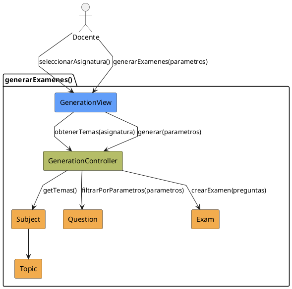

# Jorgestor > CU-02-generarExamenes > Análisis

> |[🏠️](/Jorgestor/RUP/README.md)|[ 📊](#)|[Detalle](/Jorgestor/RUP/00-casos-uso/02-detalle/CU-02-generarExamenes/README.md)|**Análisis**|Diseño|Desarrollo|Pruebas|
> |-|-|-|-|-|-|-|

## información del artefacto

- **Proyecto**: Jorgestor
- **Fase RUP**: Elaboration (Elaboración)
- **Disciplina**: Análisis
- **Versión**: 1.0
- **Fecha**: 2026-05-24
- **Autor**: Equipo de desarrollo

## propósito

Análisis tecnológico agnóstico del caso de uso Generar Exámenes, siguiendo la metodología RUP. Permite analizar la lógica de generación aleatoria/ponderada de exámenes según parámetros.

## diagrama de colaboración

||
|-|
|Código fuente: [colaboracion.puml](colaboracion.puml)|

## clases de análisis identificadas

### clases model (naranja #F2AC4E)
|Clase|Responsabilidad|Trazabilidad|
|-|-|-|
|**Subject**|Contenedor de los temas y preguntas|Modelo del dominio|
|**Topic**|Sirve para filtrar las preguntas|Modelo del dominio|
|**Question**|Elemento base con dificultad asociada|Modelo del dominio|
|**Exam**|Entidad resultante que agrupa las preguntas seleccionadas|Modelo del dominio|

### clases view (azul #629EF9)
|Clase|Responsabilidad|Derivación|
|-|-|-|
|**GenerationView**|Interfaz que permite introducir parámetros, solicitar y confirmar generación|Wireframe|

### clases controller (verde #b5bd68)
|Clase|Responsabilidad|Caso de uso|
|-|-|-|
|**GenerationController**|Valida datos, filtra preguntas y ejecuta algoritmo de generación|generarExamenes()|

## mensajes de colaboración

|Origen|Destino|Mensaje|Intención|
|-|-|-|-|
|**Docente**|**GenerationView**|`seleccionarAsignatura()`|Elegir asignatura base|
|**GenerationView**|**GenerationController**|`obtenerTemas(asignatura)`|Consultar temas disponibles|
|**GenerationController**|**Subject**|`getTemas()`|Acceder a los temas de la asignatura|
|**Docente**|**GenerationView**|`generarExamenes(parametros)`|Solicitar generación|
|**GenerationView**|**GenerationController**|`generar(parametros)`|Ejecutar la generación de exámenes|
|**GenerationController**|**Question**|`filtrarPorParametros(parametros)`|Obtener banco de preguntas|
|**GenerationController**|**Exam**|`crearExamen(preguntas)`|Crear instancias de exámenes|

## trazabilidad con artefactos previos

### con especificación detallada
- **Estados internos** → `RequiringGeneration`, `ProvidingData`, `ProvidingConfirmation`

