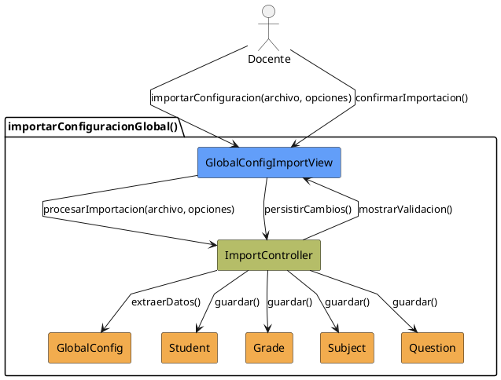

# Jorgestor > CU-03-importarConfiguracionGlobal > Análisis

## información del artefacto

- **Proyecto**: Jorgestor
- **Fase RUP**: Elaboration (Elaboración)
- **Disciplina**: Análisis
- **Versión**: 1.0
- **Fecha**: 2026-05-24
- **Autor**: Equipo de desarrollo

## propósito

Análisis del caso de uso Importar Configuración Global. Describe el proceso masivo de carga y validación de entidades principales.

## diagrama de colaboración

||
|-|
|Código fuente: [analisis-colaboracion-CU-03-importarConfiguracionGlobal.puml](analisis-colaboracion-CU-03-importarConfiguracionGlobal.puml)|

## realización de diseño (secuencia)

||
|-|
|Código fuente: [analisis-secuencia-CU-03-importarConfiguracionGlobal.puml](analisis-secuencia-CU-03-importarConfiguracionGlobal.puml)|

## clases de análisis identificadas

### clases model (naranja #F2AC4E)
|Clase|Responsabilidad|Trazabilidad|
|-|-|-|
|**Student**|Entidad que representa a los alumnos a importar|Modelo del dominio|
|**Grade**|Entidad que representa los grados académicos|Modelo del dominio|
|**Subject**|Entidad que representa las asignaturas|Modelo del dominio|
|**Question**|Entidad que representa las preguntas|Modelo del dominio|
|**GlobalConfig**|Contenedor temporal de todos los datos extraídos antes de persistir|Análisis|

### clases view (azul #629EF9)
|Clase|Responsabilidad|Derivación|
|-|-|-|
|**GlobalConfigImportView**|Interfaz para seleccionar archivo, opciones y confirmación|Wireframe|

### clases controller (verde #b5bd68)
|Clase|Responsabilidad|Caso de uso|
|-|-|-|
|**ImportController**|Orquesta el flujo de importación, validación y persistencia|importarConfiguracionGlobal()|

## mensajes de colaboración

|Origen|Destino|Mensaje|Intención|
|-|-|-|-|
|**Docente**|**GlobalConfigImportView**|`importarConfiguracion(archivo, opciones)`|Solicitar importación|
|**GlobalConfigImportView**|**ImportController**|`procesarImportacion(archivo, opciones)`|Validar y procesar datos|
|**ImportController**|**GlobalConfig**|`extraerDatos()`|Generar contenedor temporal|
|**ImportController**|**GlobalConfigImportView**|`mostrarValidacion()`|Solicitar confirmación de cambios|
|**Docente**|**GlobalConfigImportView**|`confirmarImportacion()`|Confirmar cambios|
|**GlobalConfigImportView**|**ImportController**|`persistirCambios()`|Ejecutar persistencia masiva|
|**ImportController**|**Student**|`guardar()`|Persistir entidad|
|**ImportController**|**Grade**|`guardar()`|Persistir entidad|

## trazabilidad con artefactos previos

- **Atomicidad**: Operación que mantiene la consistencia del sistema o falla de forma controlada.

