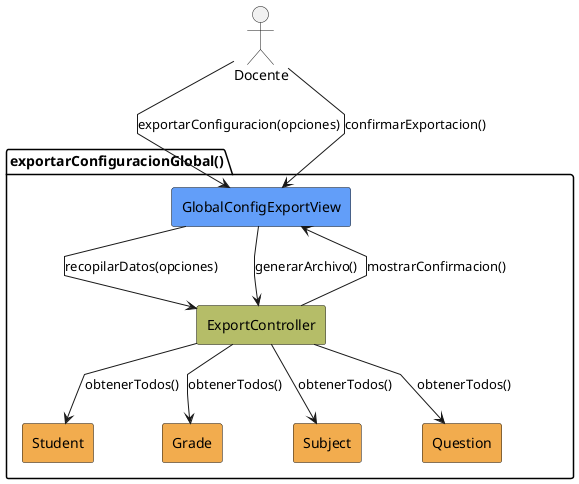

# Jorgestor > CU-04-exportarConfiguracionGlobal > Análisis

> |[🏠️](/Jorgestor/RUP/README.md)|[ 📊](#)|[Detalle](/Jorgestor/RUP/00-casos-uso/02-detalle/CU-04-exportarConfiguracionGlobal/README.md)|**Análisis**|Diseño|Desarrollo|Pruebas|
> |-|-|-|-|-|-|-|

## información del artefacto

- **Proyecto**: Jorgestor
- **Fase RUP**: Elaboration (Elaboración)
- **Disciplina**: Análisis
- **Versión**: 1.0
- **Fecha**: 2026-05-24
- **Autor**: Equipo de desarrollo

## propósito

Análisis del caso de uso Exportar Configuración Global. Describe el proceso de extracción de datos masivos.

## diagrama de colaboración

||
|-|
|Código fuente: [analisis-colaboracion-CU-04-exportarConfiguracionGlobal.puml](analisis-colaboracion-CU-04-exportarConfiguracionGlobal.puml)|

## clases de análisis identificadas

### clases model (naranja #F2AC4E)
|Clase|Responsabilidad|Trazabilidad|
|-|-|-|
|**Student**|Fuente de datos de alumnos|Modelo del dominio|
|**Grade**|Fuente de datos de grados|Modelo del dominio|
|**Subject**|Fuente de datos de asignaturas|Modelo del dominio|
|**Question**|Fuente de datos de preguntas|Modelo del dominio|

### clases view (azul #629EF9)
|Clase|Responsabilidad|Derivación|
|-|-|-|
|**GlobalConfigExportView**|Interfaz para configurar la exportación|Wireframe|

### clases controller (verde #b5bd68)
|Clase|Responsabilidad|Caso de uso|
|-|-|-|
|**ExportController**|Recopila instancias, estructura y genera salida|exportarConfiguracionGlobal()|

## mensajes de colaboración

|Origen|Destino|Mensaje|Intención|
|-|-|-|-|
|**Docente**|**GlobalConfigExportView**|`exportarConfiguracion(opciones)`|Solicitar exportación|
|**GlobalConfigExportView**|**ExportController**|`recopilarDatos(opciones)`|Delegar la recopilación de datos|
|**ExportController**|**Student**|`obtenerTodos()`|Consultar fuente|
|**ExportController**|**Grade**|`obtenerTodos()`|Consultar fuente|
|**ExportController**|**Subject**|`obtenerTodos()`|Consultar fuente|
|**ExportController**|**Question**|`obtenerTodos()`|Consultar fuente|
|**ExportController**|**GlobalConfigExportView**|`mostrarConfirmacion()`|Confirmar archivo generado|
|**Docente**|**GlobalConfigExportView**|`confirmarExportacion()`|Confirmar descarga/generación|
|**GlobalConfigExportView**|**ExportController**|`generarArchivo()`|Generar archivo final|

## trazabilidad con artefactos previos

- **Consistencia**: La exportación debe asegurar que los datos extraídos sean coherentes entre sí.

