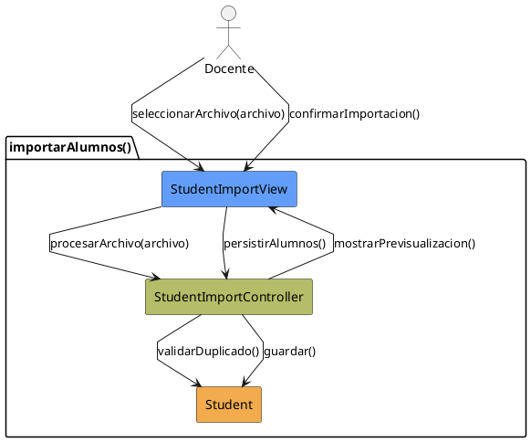

# Jorgestor > CU-05-importarAlumnos > Análisis

> |[🏠️](/Jorgestor/RUP/README.md)|[ 📊](#)|[Detalle](/Jorgestor/RUP/00-casos-uso/02-detalle/CU-05-importarAlumnos/README.md)|**Análisis**|Diseño|Desarrollo|Pruebas|
> |-|-|-|-|-|-|-|

## información del artefacto

- **Proyecto**: Jorgestor
- **Fase RUP**: Elaboration (Elaboración)
- **Disciplina**: Análisis
- **Versión**: 1.0
- **Fecha**: 2026-05-24
- **Autor**: Equipo de desarrollo

## propósito

Análisis del caso de uso Importar Alumnos. Describe la importación desde archivos externos.

## diagrama de colaboración

||
|-|
|Código fuente: [analisis-colaboracion-CU-05-importarAlumnos.puml](analisis-colaboracion-CU-05-importarAlumnos.puml)|

## clases de análisis identificadas

### clases model (naranja #F2AC4E)
|Clase|Responsabilidad|Trazabilidad|
|-|-|-|
|**Student**|Entidad que representa al alumno en el sistema|Modelo del dominio|

### clases view (azul #629EF9)
|Clase|Responsabilidad|Derivación|
|-|-|-|
|**StudentImportView**|Interfaz para seleccionar archivo y confirmar importación de alumnos|Wireframe|

### clases controller (verde #b5bd68)
|Clase|Responsabilidad|Caso de uso|
|-|-|-|
|**StudentImportController**|Orquesta, valida formato y gestiona la persistencia|importarAlumnos()|

## mensajes de colaboración

|Origen|Destino|Mensaje|Intención|
|-|-|-|-|
|**Docente**|**StudentImportView**|`seleccionarArchivo(archivo)`|Proporcionar el archivo|
|**StudentImportView**|**StudentImportController**|`procesarArchivo(archivo)`|Delegar la validación y procesamiento|
|**StudentImportController**|**Student**|`validarDuplicado()`|Comprobar si el alumno ya existe|
|**StudentImportController**|**StudentImportView**|`mostrarPrevisualizacion()`|Solicitar confirmación de la importación|
|**Docente**|**StudentImportView**|`confirmarImportacion()`|Confirmar los alumnos a importar|
|**StudentImportView**|**StudentImportController**|`persistirAlumnos()`|Persistir los nuevos alumnos|
|**StudentImportController**|**Student**|`guardar()`|Guardar alumnos en el sistema|

## trazabilidad con artefactos previos

- **Especialización**: Se centra exclusivamente en la entidad `Student`.

