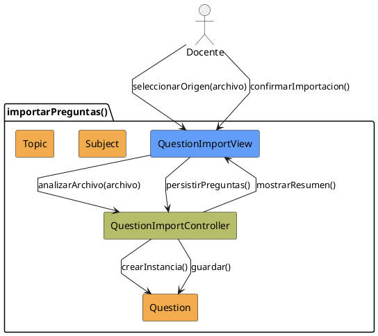

# Jorgestor > CU-06-importarPreguntas > Análisis

## información del artefacto

- **Proyecto**: Jorgestor
- **Fase RUP**: Elaboration (Elaboración)
- **Disciplina**: Análisis
- **Versión**: 1.0
- **Fecha**: 2026-05-24
- **Autor**: Equipo de desarrollo

## propósito

Análisis del caso de uso Importar Preguntas. Permite la carga masiva de preguntas al banco de datos.

## diagrama de colaboración

||
|-|
|Código fuente: [analisis-colaboracion-CU-06-importarPreguntas.puml](analisis-colaboracion-CU-06-importarPreguntas.puml)|

## clases de análisis identificadas

### clases model (naranja #F2AC4E)
|Clase|Responsabilidad|Trazabilidad|
|-|-|-|
|**Question**|Entidad pregunta que será creada o actualizada|Modelo del dominio|
|**Subject**|Asignatura para contextualizar la importación|Modelo del dominio|
|**Topic**|Tema para contextualizar la importación|Modelo del dominio|

### clases view (azul #629EF9)
|Clase|Responsabilidad|Derivación|
|-|-|-|
|**QuestionImportView**|Interfaz para cargar archivo y confirmar integración|Wireframe|

### clases controller (verde #b5bd68)
|Clase|Responsabilidad|Caso de uso|
|-|-|-|
|**QuestionImportController**|Valida formato y asocia preguntas a entidades|importarPreguntas()|

## mensajes de colaboración

|Origen|Destino|Mensaje|Intención|
|-|-|-|-|
|**Docente**|**QuestionImportView**|`seleccionarOrigen(archivo)`|Proporcionar el archivo de preguntas|
|**QuestionImportView**|**QuestionImportController**|`analizarArchivo(archivo)`|Delegar la validación y procesamiento|
|**QuestionImportController**|**Question**|`crearInstancia()`|Instanciar nuevas preguntas|
|**QuestionImportController**|**QuestionImportView**|`mostrarResumen()`|Solicitar confirmación|
|**Docente**|**QuestionImportView**|`confirmarImportacion()`|Confirmar integración|
|**QuestionImportView**|**QuestionImportController**|`persistirPreguntas()`|Ejecutar persistencia|
|**QuestionImportController**|**Question**|`guardar()`|Persistir entidad|

## trazabilidad con artefactos previos

- **Contextualidad**: Puede ocurrir en estados general o contextual.
- **Integridad**: Validación de requisitos mínimos (ej: respuesta correcta).

