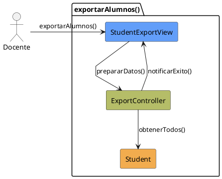

# Jorgestor > CU-07-exportarAlumnos > Análisis

## información del artefacto

- **Proyecto**: Jorgestor
- **Fase RUP**: Elaboration (Elaboración)
- **Disciplina**: Análisis
- **Versión**: 1.0
- **Fecha**: 2026-05-24
- **Autor**: Equipo de desarrollo

## propósito

Análisis del caso de uso Exportar Alumnos.

## diagrama de colaboración

||
|-|
|Código fuente: [analisis-colaboracion-CU-07-exportarAlumnos.puml](analisis-colaboracion-CU-07-exportarAlumnos.puml)|

## clases de análisis identificadas

### clases model (naranja #F2AC4E)
|Clase|Responsabilidad|Trazabilidad|
|-|-|-|
|**Student**|Fuente de los datos de alumnos|Modelo del dominio|

### clases view (azul #629EF9)
|Clase|Responsabilidad|Derivación|
|-|-|-|
|**StudentExportView**|Interfaz para solicitar exportación y ver resultado|Wireframe|

### clases controller (verde #b5bd68)
|Clase|Responsabilidad|Caso de uso|
|-|-|-|
|**ExportController**|Gestiona extracción y transformación de datos|exportarAlumnos()|

## mensajes de colaboración

|Origen|Destino|Mensaje|Intención|
|-|-|-|-|
|**Docente**|**StudentExportView**|`exportarAlumnos()`|Solicitar exportación|
|**StudentExportView**|**ExportController**|`prepararDatos()`|Delegar preparación|
|**ExportController**|**Student**|`obtenerTodos()`|Consultar fuente|
|**ExportController**|**StudentExportView**|`notificarExito()`|Informar resultado|

## trazabilidad con artefactos previos

- **Abstracción**: Puede ser invocado de forma independiente o como parte de la Exportación Global.

