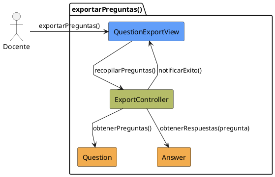

# Jorgestor > CU-08-exportarPreguntas > Análisis

> |[🏠️](/Jorgestor/RUP/README.md)|[ 📊](#)|[Detalle](/Jorgestor/RUP/00-casos-uso/02-detalle/CU-08-exportarPreguntas/README.md)|**Análisis**|Diseño|Desarrollo|Pruebas|
> |-|-|-|-|-|-|-|

## información del artefacto

- **Proyecto**: Jorgestor
- **Fase RUP**: Elaboration (Elaboración)
- **Disciplina**: Análisis
- **Versión**: 1.0
- **Fecha**: 2026-05-24
- **Autor**: Equipo de desarrollo

## propósito

Análisis del caso de uso Exportar Preguntas.

## diagrama de colaboración

||
|-|
|Código fuente: [analisis-colaboracion-CU-08-exportarPreguntas.puml](analisis-colaboracion-CU-08-exportarPreguntas.puml)|

## clases de análisis identificadas

### clases model (naranja #F2AC4E)
|Clase|Responsabilidad|Trazabilidad|
|-|-|-|
|**Question**|Representa la pregunta con enunciado y metadatos|Modelo del dominio|
|**Answer**|Contiene las opciones de respuesta|Modelo del dominio|

### clases view (azul #629EF9)
|Clase|Responsabilidad|Derivación|
|-|-|-|
|**QuestionExportView**|Interfaz para gestionar exportación|Wireframe|

### clases controller (verde #b5bd68)
|Clase|Responsabilidad|Caso de uso|
|-|-|-|
|**ExportController**|Orquesta recopilación y asegura integridad|exportarPreguntas()|

## mensajes de colaboración

|Origen|Destino|Mensaje|Intención|
|-|-|-|-|
|**Docente**|**QuestionExportView**|`exportarPreguntas()`|Solicitar exportación|
|**QuestionExportView**|**ExportController**|`recopilarPreguntas()`|Delegar recopilación|
|**ExportController**|**Question**|`obtenerPreguntas()`|Consultar fuente|
|**ExportController**|**Answer**|`obtenerRespuestas(pregunta)`|Consultar respuestas asociadas|
|**ExportController**|**QuestionExportView**|`notificarExito()`|Informar resultado|

## trazabilidad con artefactos previos

- **Integridad**: Debe incluir todas las respuestas asociadas a cada pregunta.

