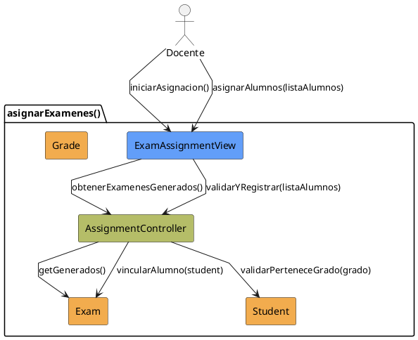

# Jorgestor > CU-09-asignarExamenes > Análisis

## información del artefacto

- **Proyecto**: Jorgestor
- **Fase RUP**: Elaboration (Elaboración)
- **Disciplina**: Análisis
- **Versión**: 1.0
- **Fecha**: 2026-05-24
- **Autor**: Equipo de desarrollo

## propósito

Análisis del caso de uso Asignar Exámenes. Vincula exámenes generados con alumnos.

## diagrama de colaboración

||
|-|
|Código fuente: [analisis-colaboracion-CU-09-asignarExamenes.puml](analisis-colaboracion-CU-09-asignarExamenes.puml)|

## realización de diseño (secuencia)

||
|-|
|Código fuente: [analisis-secuencia-CU-09-asignarExamenes.puml](analisis-secuencia-CU-09-asignarExamenes.puml)|

## clases de análisis identificadas

### clases model (naranja #F2AC4E)
|Clase|Responsabilidad|Trazabilidad|
|-|-|-|
|**Exam**|El examen generado que será asignado|Modelo del dominio|
|**Student**|El alumno que recibirá el examen|Modelo del dominio|
|**Grade**|Utilizado para filtrar o agrupar alumnos|Modelo del dominio|

### clases view (azul #629EF9)
|Clase|Responsabilidad|Derivación|
|-|-|-|
|**ExamAssignmentView**|Interfaz para introducir o confirmar destinatarios|Wireframe|

### clases controller (verde #b5bd68)
|Clase|Responsabilidad|Caso de uso|
|-|-|-|
|**AssignmentController**|Gestiona vinculación y valida alumnos/grados|asignarExamenes()|

## mensajes de colaboración

|Origen|Destino|Mensaje|Intención|
|-|-|-|-|
|**Docente**|**ExamAssignmentView**|`iniciarAsignacion()`|Solicitar inicio|
|**ExamAssignmentView**|**AssignmentController**|`obtenerExamenesGenerados()`|Consultar exámenes disponibles|
|**Docente**|**ExamAssignmentView**|`asignarAlumnos(listaAlumnos)`|Proporcionar destinatarios|
|**ExamAssignmentView**|**AssignmentController**|`validarYRegistrar(listaAlumnos)`|Registrar vinculación|
|**AssignmentController**|**Student**|`validarPerteneceGrado(grado)`|Verificar integridad|
|**AssignmentController**|**Exam**|`vincularAlumno(student)`|Crear relación|

## trazabilidad con artefactos previos

- **Contextualización**: Transforma exámenes generados en exámenes asignados.
- **Validación**: Asegura que alumnos correspondan al grado del examen.

```plantuml
@startuml CU-09-asignarExamenes-diseno

skinparam linetype polyline

actor "Docente" as Actor
participant ":AssignmentController" as Controller <<boundary>>
participant ":AssignmentService" as Service <<control>>
participant ":StudentRepository" as SRepo <<entity>>
participant ":ExamRepository" as ERepo <<entity>>
participant "exam:Exam" as Entity <<entity>>

title Diseño Técnico: asignarExamenes() (Generación de Hash)

Actor -> Controller : POST /api/assignments (AssignmentDTO)
activate Controller

Controller -> Service : assignExamsToStudents(dto)
activate Service

loop por cada emparejamiento (ExamID, StudentID)
    Service -> SRepo : findById(studentID)
    Service -> ERepo : findById(examID)
    
    Service -> Service : generateCorrectionHash(examData, studentData)
    note right
    **Algoritmo de Hash (MD5/SHA)**
    Combina: Asignatura + Alumno + Respuestas
    end note
    
    Service -> Entity : assignStudent(student)
    Service -> Entity : setCorrectionKey(generatedHash)
    
    Service -> ERepo : save(exam)
end

Service --> Controller : List<AssignmentSummary>
deactivate Service

Controller --> Actor : 200 OK
deactivate Controller

@enduml
```

