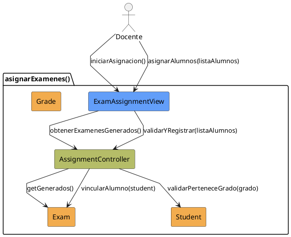
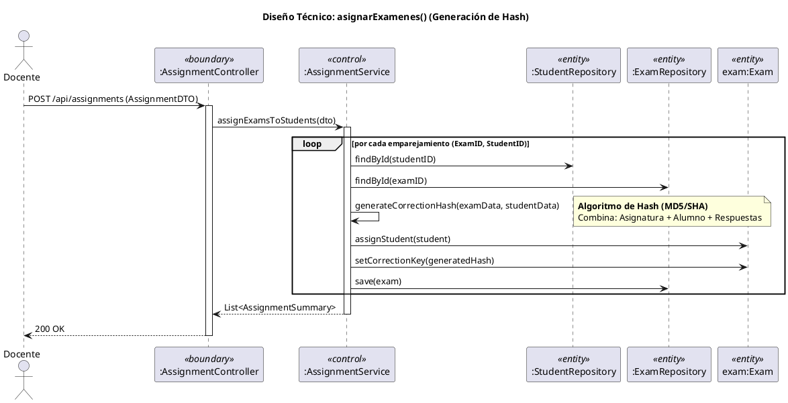

# Jorgestor > CU-09-asignarExamenes > Análisis

> |[🏠️](/Jorgestor/RUP/README.md)|[ 📊](#)|[Detalle](/Jorgestor/RUP/00-casos-uso/02-detalle/CU-09-asignarExamenes/README.md)|**Análisis**|Diseño|Desarrollo|Pruebas|
> |-|-|-|-|-|-|-|

## información del artefacto

- **Proyecto**: Jorgestor
- **Fase RUP**: Elaboration (Elaboración)
- **Disciplina**: Análisis
- **Versión**: 1.0
- **Fecha**: 2026-05-24
- **Autor**: Equipo de desarrollo

## propósito

Análisis del caso de uso Asignar Exámenes. Vincula exámenes generados con alumnos.

## diagrama de colaboración

||
|-|
|Código fuente: [colaboracion.puml](colaboracion.puml)|

## realización de diseño (secuencia)

||
|-|
|Código fuente: [secuencia.puml](secuencia.puml)|

## clases de análisis identificadas

### clases model (naranja #F2AC4E)
|Clase|Responsabilidad|Trazabilidad|
|-|-|-|
|**Exam**|El examen generado que será asignado|Modelo del dominio|
|**Student**|El alumno que recibirá el examen|Modelo del dominio|
|**Grade**|Utilizado para filtrar o agrupar alumnos|Modelo del dominio|

### clases view (azul #629EF9)
|Clase|Responsabilidad|Derivación|
|-|-|-|
|**ExamAssignmentView**|Interfaz para introducir o confirmar destinatarios|Wireframe|

### clases controller (verde #b5bd68)
|Clase|Responsabilidad|Caso de uso|
|-|-|-|
|**AssignmentController**|Gestiona vinculación y valida alumnos/grados|asignarExamenes()|

## mensajes de colaboración

|Origen|Destino|Mensaje|Intención|
|-|-|-|-|
|**Docente**|**ExamAssignmentView**|`iniciarAsignacion()`|Solicitar inicio|
|**ExamAssignmentView**|**AssignmentController**|`obtenerExamenesGenerados()`|Consultar exámenes disponibles|
|**Docente**|**ExamAssignmentView**|`asignarAlumnos(listaAlumnos)`|Proporcionar destinatarios|
|**ExamAssignmentView**|**AssignmentController**|`validarYRegistrar(listaAlumnos)`|Registrar vinculación|
|**AssignmentController**|**Student**|`validarPerteneceGrado(grado)`|Verificar integridad|
|**AssignmentController**|**Exam**|`vincularAlumno(student)`|Crear relación|

## trazabilidad con artefactos previos

- **Contextualización**: Transforma exámenes generados en exámenes asignados.
- **Validación**: Asegura que alumnos correspondan al grado del examen.

