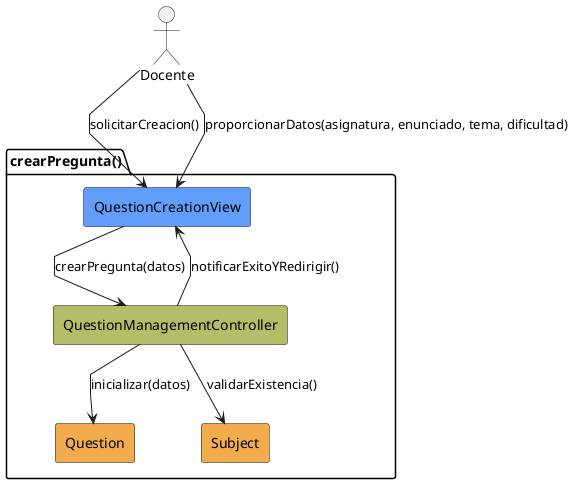

# Jorgestor > CU-10-crearPregunta > Análisis

## información del artefacto

- **Proyecto**: Jorgestor
- **Fase RUP**: Elaboration (Elaboración)
- **Disciplina**: Análisis
- **Versión**: 1.0
- **Fecha**: 2026-05-24
- **Autor**: Equipo de desarrollo

## propósito

Análisis del caso de uso Crear Pregunta. Permite la inicialización de una nueva pregunta.

## diagrama de colaboración

||
|-|
|Código fuente: [analisis-colaboracion-CU-10-crearPregunta.puml](analisis-colaboracion-CU-10-crearPregunta.puml)|

## clases de análisis identificadas

### clases model (naranja #F2AC4E)
|Clase|Responsabilidad|Trazabilidad|
|-|-|-|
|**Question**|Nueva entidad de pregunta que se crea|Modelo del dominio|
|**Subject**|Asignatura a la que se asociará la pregunta|Modelo del dominio|

### clases view (azul #629EF9)
|Clase|Responsabilidad|Derivación|
|-|-|-|
|**QuestionCreationView**|Interfaz para solicitar datos obligatorios iniciales|Wireframe|

### clases controller (verde #b5bd68)
|Clase|Responsabilidad|Caso de uso|
|-|-|-|
|**QuestionManagementController**|Gestiona creación de instancia y valida campos|crearPregunta()|

## mensajes de colaboración

|Origen|Destino|Mensaje|Intención|
|-|-|-|-|
|**Docente**|**QuestionCreationView**|`solicitarCreacion()`|Iniciar proceso|
|**Docente**|**QuestionCreationView**|`proporcionarDatos(asignatura, enunciado, tema, dificultad)`|Enviar datos mínimos|
|**QuestionCreationView**|**QuestionManagementController**|`crearPregunta(datos)`|Delegar la creación|
|**QuestionManagementController**|**Subject**|`validarExistencia()`|Verificar asignatura|
|**QuestionManagementController**|**Question**|`inicializar(datos)`|Crear nueva instancia|
|**QuestionManagementController**|**QuestionCreationView**|`notificarExitoYRedirigir()`|Informar y pasar a edición|

## trazabilidad con artefactos previos

- **Encadenamiento**: Redirige automáticamente a `editarPregunta` para completar detalles.

