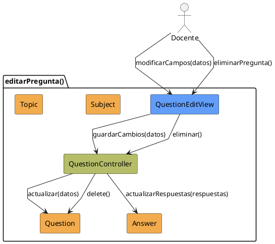

# Jorgestor > CU-11-editarPregunta > Análisis

## información del artefacto

- **Proyecto**: Jorgestor
- **Fase RUP**: Elaboration (Elaboración)
- **Disciplina**: Análisis
- **Versión**: 1.0
- **Fecha**: 2026-05-24
- **Autor**: Equipo de desarrollo

## propósito

Análisis del caso de uso Editar Pregunta. Permite la modificación de una pregunta y sus respuestas.

## diagrama de colaboración

||
|-|
|Código fuente: [analisis-colaboracion-CU-11-editarPregunta.puml](analisis-colaboracion-CU-11-editarPregunta.puml)|

## clases de análisis identificadas

### clases model (naranja #F2AC4E)
|Clase|Responsabilidad|Trazabilidad|
|-|-|-|
|**Question**|La entidad pregunta a editar|Modelo del dominio|
|**Subject**|Asignatura asociada|Modelo del dominio|
|**Topic**|Tema asociado|Modelo del dominio|
|**Answer**|Respuestas vinculadas a la pregunta|Modelo del dominio|

### clases view (azul #629EF9)
|Clase|Responsabilidad|Derivación|
|-|-|-|
|**QuestionEditView**|Interfaz que presenta datos actuales y permite edición|Wireframe|

### clases controller (verde #b5bd68)
|Clase|Responsabilidad|Caso de uso|
|-|-|-|
|**QuestionController**|Coordina actualización, valida cambios y gestiona persistencia|editarPregunta()|

## mensajes de colaboración

|Origen|Destino|Mensaje|Intención|
|-|-|-|-|
|**Docente**|**QuestionEditView**|`modificarCampos(datos)`|Introducir cambios|
|**QuestionEditView**|**QuestionController**|`guardarCambios(datos)`|Solicitar persistencia|
|**QuestionController**|**Question**|`actualizar(datos)`|Modificar entidad|
|**QuestionController**|**Answer**|`actualizarRespuestas(respuestas)`|Modificar respuestas vinculadas|
|**Docente**|**QuestionEditView**|`eliminarPregunta()`|Solicitar eliminación|
|**QuestionEditView**|**QuestionController**|`eliminar()`|Gestionar eliminación de la entidad|

## trazabilidad con artefactos previos

- **Contextualidad**: Permite edición tanto en contextos generales como específicos de asignatura.
- **Eliminación**: Considera dependencias (ej: uso en exámenes generados).

