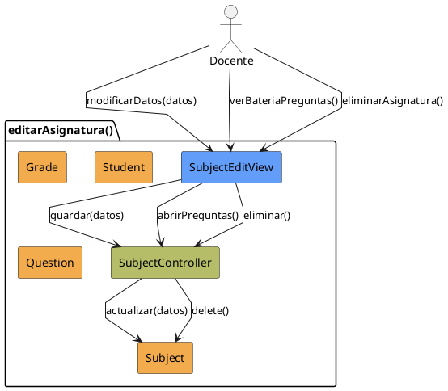

# Jorgestor > CU-12-editarAsignatura > Análisis

## información del artefacto

- **Proyecto**: Jorgestor
- **Fase RUP**: Elaboration (Elaboración)
- **Disciplina**: Análisis
- **Versión**: 1.0
- **Fecha**: 2026-05-24
- **Autor**: Equipo de desarrollo

## propósito

Análisis del caso de uso Editar Asignatura. Actúa como centro de operaciones para los recursos vinculados.

## diagrama de colaboración

||
|-|
|Código fuente: [analisis-colaboracion-CU-12-editarAsignatura.puml](analisis-colaboracion-CU-12-editarAsignatura.puml)|

## clases de análisis identificadas

### clases model (naranja #F2AC4E)
|Clase|Responsabilidad|Trazabilidad|
|-|-|-|
|**Subject**|La entidad asignatura que se está editando|Modelo del dominio|
|**Grade**|Grados asociados a la asignatura|Modelo del dominio|
|**Student**|Alumnos matriculados|Modelo del dominio|
|**Question**|Preguntas de la batería de la asignatura|Modelo del dominio|

### clases view (azul #629EF9)
|Clase|Responsabilidad|Derivación|
|-|-|-|
|**SubjectEditView**|Interfaz que muestra información y ofrece accesos a gestión|Wireframe|

### clases controller (verde #b5bd68)
|Clase|Responsabilidad|Caso de uso|
|-|-|-|
|**SubjectController**|Orquesta edición, atributos y coordinación con otros CU|editarAsignatura()|

## mensajes de colaboración

|Origen|Destino|Mensaje|Intención|
|-|-|-|-|
|**Docente**|**SubjectEditView**|`modificarDatos(datos)`|Editar campos básicos|
|**SubjectEditView**|**SubjectController**|`guardar(datos)`|Solicitar actualización|
|**SubjectController**|**Subject**|`actualizar(datos)`|Persistir cambios en entidad|
|**Docente**|**SubjectEditView**|`verBateriaPreguntas()`|Solicitar visualización de preguntas|
|**SubjectEditView**|**SubjectController**|`abrirPreguntas()`|Redirigir a gestión de preguntas|
|**Docente**|**SubjectEditView**|`eliminarAsignatura()`|Solicitar eliminación|
|**SubjectEditView**|**SubjectController**|`eliminar()`|Gestionar eliminación de asignatura|

## trazabilidad con artefactos previos

- **HUB**: Actúa como centro de operaciones para gestionar recursos vinculados.
- **Seguridad**: Eliminación verifica si existen exámenes asociados.

