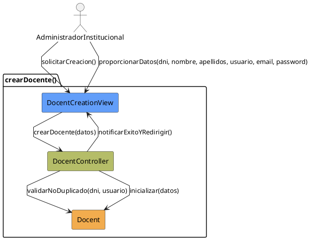

# Jorgestor > CU-13-crearDocente > Análisis

> |[🏠️](/Jorgestor/RUP/README.md)|[ 📊](#)|[Detalle](/Jorgestor/RUP/00-casos-uso/02-detalle/CU-13-crearDocente/README.md)|**Análisis**|Diseño|Desarrollo|Pruebas|
> |-|-|-|-|-|-|-|

## información del artefacto

- **Proyecto**: Jorgestor
- **Fase RUP**: Elaboration (Elaboración)
- **Disciplina**: Análisis
- **Versión**: 1.0
- **Fecha**: 2026-05-24
- **Autor**: Equipo de desarrollo

## propósito

Análisis del caso de uso Crear Docente. Permite dar de alta a un nuevo profesor.

## diagrama de colaboración

||
|-|
|Código fuente: [colaboracion.puml](colaboracion.puml)|

## clases de análisis identificadas

### clases model (naranja #F2AC4E)
|Clase|Responsabilidad|Trazabilidad|
|-|-|-|
|**Docent**|Entidad que representa al nuevo profesor en el sistema|Modelo del dominio|

### clases view (azul #629EF9)
|Clase|Responsabilidad|Derivación|
|-|-|-|
|**DocentCreationView**|Interfaz para introducir datos mínimos obligatorios|Wireframe|

### clases controller (verde #b5bd68)
|Clase|Responsabilidad|Caso de uso|
|-|-|-|
|**DocentController**|Gestiona creación y valida datos obligatorios/duplicados|crearDocente()|

## mensajes de colaboración

|Origen|Destino|Mensaje|Intención|
|-|-|-|-|
|**AdministradorInstitucional**|**DocentCreationView**|`solicitarCreacion()`|Iniciar proceso|
|**AdministradorInstitucional**|**DocentCreationView**|`proporcionarDatos(dni, nombre, apellidos, usuario, email, password)`|Enviar información|
|**DocentCreationView**|**DocentController**|`crearDocente(datos)`|Delegar la creación|
|**DocentController**|**Docent**|`validarNoDuplicado(dni, usuario)`|Verificar integridad|
|**DocentController**|**Docent**|`inicializar(datos)`|Crear nueva instancia|
|**DocentController**|**DocentCreationView**|`notificarExitoYRedirigir()`|Informar y pasar a edición|

## trazabilidad con artefactos previos

- **Flujo**: Redirige a edición para completar perfiles complejos.

