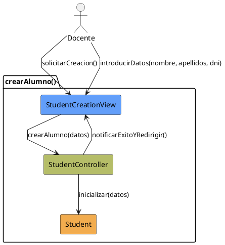

# Jorgestor > CU-14-crearAlumno > Análisis

> |[🏠️](/Jorgestor/RUP/README.md)|[ 📊](#)|[Detalle](/Jorgestor/RUP/00-casos-uso/02-detalle/CU-14-crearAlumno/README.md)|**Análisis**|Diseño|Desarrollo|Pruebas|
> |-|-|-|-|-|-|-|

## información del artefacto

- **Proyecto**: Jorgestor
- **Fase RUP**: Elaboration (Elaboración)
- **Disciplina**: Análisis
- **Versión**: 1.0
- **Fecha**: 2026-05-24
- **Autor**: Equipo de desarrollo

## propósito

Análisis del caso de uso Crear Alumno. Permite registrar un nuevo estudiante.

## diagrama de colaboración

||
|-|
|Código fuente: [colaboracion.puml](colaboracion.puml)|

## clases de análisis identificadas

### clases model (naranja #F2AC4E)
|Clase|Responsabilidad|Trazabilidad|
|-|-|-|
|**Student**|Entidad que representa al alumno|Modelo del dominio|

### clases view (azul #629EF9)
|Clase|Responsabilidad|Derivación|
|-|-|-|
|**StudentCreationView**|Interfaz que solicita los datos mínimos necesarios|Wireframe|

### clases controller (verde #b5bd68)
|Clase|Responsabilidad|Caso de uso|
|-|-|-|
|**StudentController**|Gestiona creación de instancia y valida integridad|crearAlumno()|

## mensajes de colaboración

|Origen|Destino|Mensaje|Intención|
|-|-|-|-|
|**Docente**|**StudentCreationView**|`solicitarCreacion()`|Iniciar proceso|
|**Docente**|**StudentCreationView**|`introducirDatos(nombre, apellidos, dni)`|Enviar información obligatoria|
|**StudentCreationView**|**StudentController**|`crearAlumno(datos)`|Delegar la creación|
|**StudentController**|**Student**|`inicializar(datos)`|Crear nueva entidad|
|**StudentController**|**StudentCreationView**|`notificarExitoYRedirigir()`|Informar y pasar a edición|

## trazabilidad con artefactos previos

- **Estrategia**: Garantiza existencia del objeto, delegando detalles a edición.

