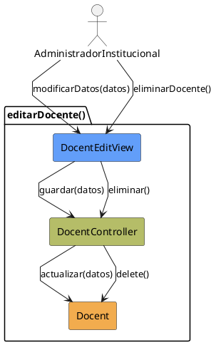

# Jorgestor > CU-15-editarDocente > Análisis

## información del artefacto

- **Proyecto**: Jorgestor
- **Fase RUP**: Elaboration (Elaboración)
- **Disciplina**: Análisis
- **Versión**: 1.0
- **Fecha**: 2026-05-24
- **Autor**: Equipo de desarrollo

## propósito

Análisis del caso de uso Editar Docente.

## diagrama de colaboración

||
|-|
|Código fuente: [analisis-colaboracion-CU-15-editarDocente.puml](analisis-colaboracion-CU-15-editarDocente.puml)|

## clases de análisis identificadas

### clases model (naranja #F2AC4E)
|Clase|Responsabilidad|Trazabilidad|
|-|-|-|
|**Docent**|La entidad docente que se está editando|Modelo del dominio|

### clases view (azul #629EF9)
|Clase|Responsabilidad|Derivación|
|-|-|-|
|**DocentEditView**|Interfaz que muestra datos actuales y permite modificación o eliminación|Wireframe|

### clases controller (verde #b5bd68)
|Clase|Responsabilidad|Caso de uso|
|-|-|-|
|**DocentController**|Gestiona actualización y lógica de eliminación|editarDocente()|

## mensajes de colaboración

|Origen|Destino|Mensaje|Intención|
|-|-|-|-|
|**AdministradorInstitucional**|**DocentEditView**|`modificarDatos(datos)`|Introducir cambios|
|**DocentEditView**|**DocentController**|`guardar(datos)`|Solicitar actualización|
|**DocentController**|**Docent**|`actualizar(datos)`|Persistir cambios|
|**AdministradorInstitucional**|**DocentEditView**|`eliminarDocente()`|Solicitar eliminación|
|**DocentEditView**|**DocentController**|`eliminar()`|Gestionar eliminación|
|**DocentController**|**Docent**|`delete()`|Eliminar entidad|

## trazabilidad con artefactos previos

- **Identificadores**: DNI y usuario actúan como claves de integridad.

