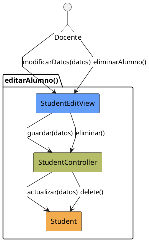

# Jorgestor > CU-16-editarAlumno > Análisis

## información del artefacto

- **Proyecto**: Jorgestor
- **Fase RUP**: Elaboration (Elaboración)
- **Disciplina**: Análisis
- **Versión**: 1.0
- **Fecha**: 2026-05-24
- **Autor**: Equipo de desarrollo

## propósito

Análisis del caso de uso Editar Alumno. Permite modificar información personal o eliminar el registro.

## diagrama de colaboración

||
|-|
|Código fuente: [analisis-colaboracion-CU-16-editarAlumno.puml](analisis-colaboracion-CU-16-editarAlumno.puml)|

## clases de análisis identificadas

### clases model (naranja #F2AC4E)
|Clase|Responsabilidad|Trazabilidad|
|-|-|-|
|**Student**|La entidad alumno que se está editando|Modelo del dominio|

### clases view (azul #629EF9)
|Clase|Responsabilidad|Derivación|
|-|-|-|
|**StudentEditView**|Interfaz para visualización y edición de datos (DNI, Nombre, Apellidos)|Wireframe|

### clases controller (verde #b5bd68)
|Clase|Responsabilidad|Caso de uso|
|-|-|-|
|**StudentController**|Coordina actualización de datos y gestiona eliminación|editarAlumno()|

## mensajes de colaboración

|Origen|Destino|Mensaje|Intención|
|-|-|-|-|
|**Docente**|**StudentEditView**|`modificarDatos(datos)`|Introducir cambios|
|**StudentEditView**|**StudentController**|`guardar(datos)`|Solicitar actualización|
|**StudentController**|**Student**|`actualizar(datos)`|Persistir cambios|
|**Docente**|**StudentEditView**|`eliminarAlumno()`|Solicitar eliminación|
|**StudentEditView**|**StudentController**|`eliminar()`|Gestionar eliminación|
|**StudentController**|**Student**|`delete()`|Eliminar entidad|

## trazabilidad con artefactos previos

- **Identificación**: Permite mantener actualizados los datos identificativos de los estudiantes.

