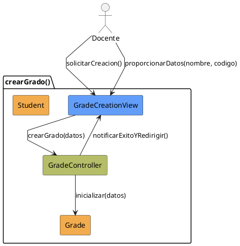

# Jorgestor > CU-17-crearGrado > Análisis

## información del artefacto

- **Proyecto**: Jorgestor
- **Fase RUP**: Elaboration (Elaboración)
- **Disciplina**: Análisis
- **Versión**: 1.0
- **Fecha**: 2026-05-24
- **Autor**: Equipo de desarrollo

## propósito

Análisis del caso de uso Crear Grado. Permite la agrupación de alumnos y asignaturas.

## diagrama de colaboración

||
|-|
|Código fuente: [analisis-colaboracion-CU-17-crearGrado.puml](analisis-colaboracion-CU-17-crearGrado.puml)|

## clases de análisis identificadas

### clases model (naranja #F2AC4E)
|Clase|Responsabilidad|Trazabilidad|
|-|-|-|
|**Grade**|La nueva entidad grado|Modelo del dominio|
|**Student**|Alumnos que se asocian al grado|Modelo del dominio|

### clases view (azul #629EF9)
|Clase|Responsabilidad|Derivación|
|-|-|-|
|**GradeCreationView**|Interfaz para introducir datos mínimos y enlistar alumnos|Wireframe|

### clases controller (verde #b5bd68)
|Clase|Responsabilidad|Caso de uso|
|-|-|-|
|**GradeController**|Gestiona creación y asociación inicial de alumnos|crearGrado()|

## mensajes de colaboración

|Origen|Destino|Mensaje|Intención|
|-|-|-|-|
|**Docente**|**GradeCreationView**|`solicitarCreacion()`|Iniciar proceso|
|**Docente**|**GradeCreationView**|`proporcionarDatos(nombre, codigo)`|Enviar datos obligatorios|
|**GradeCreationView**|**GradeController**|`crearGrado(datos)`|Delegar creación|
|**GradeController**|**Grade**|`inicializar(datos)`|Crear entidad|
|**GradeController**|**GradeCreationView**|`notificarExitoYRedirigir()`|Informar y pasar a edición|

## trazabilidad con artefactos previos

- **Estructura**: El grado sirve como estructura organizativa superior.

