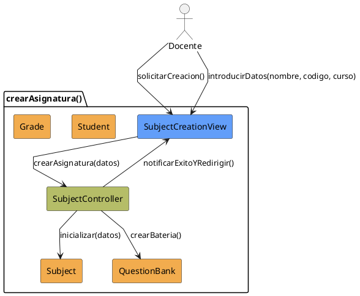

# Jorgestor > CU-18-crearAsignatura > Análisis

> |[🏠️](/Jorgestor/RUP/README.md)|[ 📊](#)|[Detalle](/Jorgestor/RUP/00-casos-uso/02-detalle/CU-18-crearAsignatura/README.md)|**Análisis**|Diseño|Desarrollo|Pruebas|
> |-|-|-|-|-|-|-|

## información del artefacto

- **Proyecto**: Jorgestor
- **Fase RUP**: Elaboration (Elaboración)
- **Disciplina**: Análisis
- **Versión**: 1.0
- **Fecha**: 2026-05-24
- **Autor**: Equipo de desarrollo

## propósito

Análisis del caso de uso Crear Asignatura. Implica la inicialización de recursos vinculados.

## diagrama de colaboración

||
|-|
|Código fuente: [colaboracion.puml](colaboracion.puml)|

## clases de análisis identificadas

### clases model (naranja #F2AC4E)
|Clase|Responsabilidad|Trazabilidad|
|-|-|-|
|**Subject**|La nueva entidad asignatura|Modelo del dominio|
|**QuestionBank**|Batería de preguntas asociada (conceptual)|Análisis|
|**Student**|Alumnos matriculados|Modelo del dominio|
|**Grade**|Grados asociados|Modelo del dominio|

### clases view (azul #629EF9)
|Clase|Responsabilidad|Derivación|
|-|-|-|
|**SubjectCreationView**|Interfaz para introducir datos mínimos, alumnos y grados|Wireframe|

### clases controller (verde #b5bd68)
|Clase|Responsabilidad|Caso de uso|
|-|-|-|
|**SubjectController**|Gestiona creación e inicialización de recursos vinculados|crearAsignatura()|

## mensajes de colaboración

|Origen|Destino|Mensaje|Intención|
|-|-|-|-|
|**Docente**|**SubjectCreationView**|`solicitarCreacion()`|Iniciar proceso|
|**Docente**|**SubjectCreationView**|`introducirDatos(nombre, codigo, curso)`|Enviar información obligatoria|
|**SubjectCreationView**|**SubjectController**|`crearAsignatura(datos)`|Delegar creación|
|**SubjectController**|**Subject**|`inicializar(datos)`|Crear entidad|
|**SubjectController**|**QuestionBank**|`crearBateria()`|Inicializar espacio de trabajo|
|**SubjectController**|**SubjectCreationView**|`notificarExitoYRedirigir()`|Informar y pasar a edición|

## trazabilidad con artefactos previos

- **Recursos**: Desencadena la creación de un espacio de trabajo (batería de preguntas).

