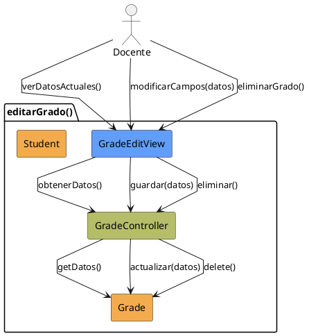

# Jorgestor > CU-19-editarGrado > Análisis

## información del artefacto

- **Proyecto**: Jorgestor
- **Fase RUP**: Elaboration (Elaboración)
- **Disciplina**: Análisis
- **Versión**: 1.0
- **Fecha**: 2026-05-24
- **Autor**: Equipo de desarrollo

## propósito

Análisis del caso de uso Editar Grado.

## diagrama de colaboración

||
|-|
|Código fuente: [analisis-colaboracion-CU-19-editarGrado.puml](analisis-colaboracion-CU-19-editarGrado.puml)|

## clases de análisis identificadas

### clases model (naranja #F2AC4E)
|Clase|Responsabilidad|Trazabilidad|
|-|-|-|
|**Grade**|Entidad que representa el grado académico|Modelo del dominio|
|**Student**|Entidades asociadas al grado|Modelo del dominio|

### clases view (azul #629EF9)
|Clase|Responsabilidad|Derivación|
|-|-|-|
|**GradeEditView**|Interfaz para visualizar, modificar o solicitar eliminación|Wireframe|

### clases controller (verde #b5bd68)
|Clase|Responsabilidad|Caso de uso|
|-|-|-|
|**GradeController**|Gestiona lógica de edición, validación y coordinación|editarGrado()|

## mensajes de colaboración

|Origen|Destino|Mensaje|Intención|
|-|-|-|-|
|**Docente**|**GradeEditView**|`verDatosActuales()`|Solicitar visualización|
|**GradeEditView**|**GradeController**|`obtenerDatos()`|Delegar recuperación|
|**GradeController**|**Grade**|`getDatos()`|Consultar entidad|
|**Docente**|**GradeEditView**|`modificarCampos(datos)`|Introducir cambios|
|**GradeEditView**|**GradeController**|`guardar(datos)`|Solicitar persistencia|
|**GradeController**|**Grade**|`actualizar(datos)`|Persistir cambios|
|**Docente**|**GradeEditView**|`eliminarGrado()`|Solicitar eliminación|
|**GradeEditView**|**GradeController**|`eliminar()`|Gestionar eliminación|

## trazabilidad con artefactos previos

- **Estados**: `EditingData`, `SavingData` (procesamiento de guardado o eliminación).

