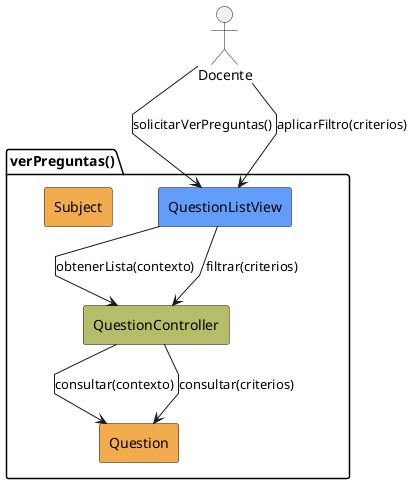

# Jorgestor > CU-20-verPreguntas > Análisis

## información del artefacto

- **Proyecto**: Jorgestor
- **Fase RUP**: Elaboration (Elaboración)
- **Disciplina**: Análisis
- **Versión**: 1.0
- **Fecha**: 2026-05-24
- **Autor**: Equipo de desarrollo

## propósito

Análisis del caso de uso Ver Preguntas. Enfocado en la visualización y filtrado de la batería.

## diagrama de colaboración

||
|-|
|Código fuente: [analisis-colaboracion-CU-20-verPreguntas.puml](analisis-colaboracion-CU-20-verPreguntas.puml)|

## clases de análisis identificadas

### clases model (naranja #F2AC4E)
|Clase|Responsabilidad|Trazabilidad|
|-|-|-|
|**Question**|Representa cada pregunta en el sistema|Modelo del dominio|
|**Subject**|Necesario para filtrado contextual|Modelo del dominio|

### clases view (azul #629EF9)
|Clase|Responsabilidad|Derivación|
|-|-|-|
|**QuestionListView**|Interfaz para visualizar lista y solicitar filtrado|Wireframe|

### clases controller (verde #b5bd68)
|Clase|Responsabilidad|Caso de uso|
|-|-|-|
|**QuestionController**|Recupera lista y aplica criterios de filtrado|verPreguntas()|

## mensajes de colaboración

|Origen|Destino|Mensaje|Intención|
|-|-|-|-|
|**Docente**|**QuestionListView**|`solicitarVerPreguntas()`|Iniciar visualización|
|**QuestionListView**|**QuestionController**|`obtenerLista(contexto)`|Delegar recuperación|
|**QuestionController**|**Question**|`consultar(contexto)`|Consultar entidades|
|**Docente**|**QuestionListView**|`aplicarFiltro(criterios)`|Solicitar filtrado|
|**QuestionListView**|**QuestionController**|`filtrar(criterios)`|Procesar criterios|

## trazabilidad con artefactos previos

- **Estados**: `ShowingQuestions` (lista inicial), `FilteringQuestions` (resultados filtrados).

