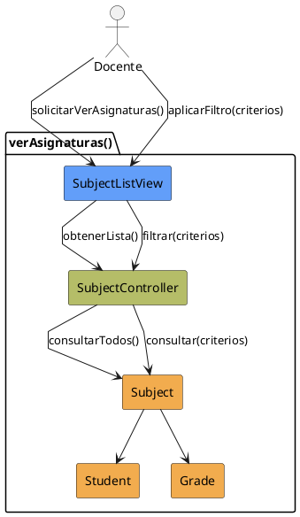

# Jorgestor > CU-21-verAsignaturas > Análisis

## información del artefacto

- **Proyecto**: Jorgestor
- **Fase RUP**: Elaboration (Elaboración)
- **Disciplina**: Análisis
- **Versión**: 1.0
- **Fecha**: 2026-05-24
- **Autor**: Equipo de desarrollo

## propósito

Análisis del caso de uso Ver Asignaturas. Enfocado en la visualización y filtrado de las materias.

## diagrama de colaboración

||
|-|
|Código fuente: [analisis-colaboracion-CU-21-verAsignaturas.puml](analisis-colaboracion-CU-21-verAsignaturas.puml)|

## clases de análisis identificadas

### clases model (naranja #F2AC4E)
|Clase|Responsabilidad|Trazabilidad|
|-|-|-|
|**Subject**|Representa la asignatura con su información básica y relaciones|Modelo del dominio|
|**Student**|Necesario para contabilizar o listar los alumnos matriculados|Modelo del dominio|
|**Grade**|Necesario para mostrar los grados asociados|Modelo del dominio|

### clases view (azul #629EF9)
|Clase|Responsabilidad|Derivación|
|-|-|-|
|**SubjectListView**|Interfaz para visualizar lista y solicitar filtrado|Wireframe|

### clases controller (verde #b5bd68)
|Clase|Responsabilidad|Caso de uso|
|-|-|-|
|**SubjectController**|Recupera lista completa y procesa solicitudes de filtrado|verAsignaturas()|

## mensajes de colaboración

|Origen|Destino|Mensaje|Intención|
|-|-|-|-|
|**Docente**|**SubjectListView**|`solicitarVerAsignaturas()`|Iniciar visualización|
|**SubjectListView**|**SubjectController**|`obtenerLista()`|Delegar recuperación|
|**SubjectController**|**Subject**|`consultarTodos()`|Consultar entidades|
|**Docente**|**SubjectListView**|`aplicarFiltro(criterios)`|Solicitar filtrado|
|**SubjectListView**|**SubjectController**|`filtrar(criterios)`|Procesar criterios|

## trazabilidad con artefactos previos

- **Estados**: `ShowingSubjects`, `FilteringSubjects`.

