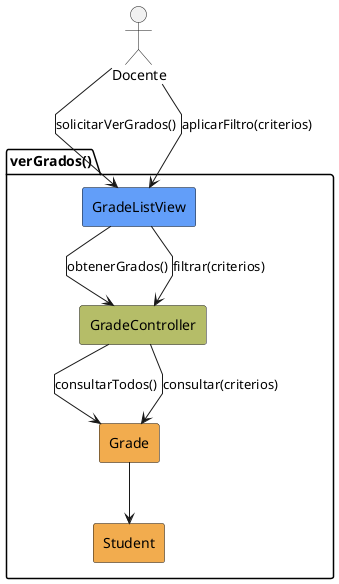

# Jorgestor > CU-22-verGrados > Análisis

## información del artefacto

- **Proyecto**: Jorgestor
- **Fase RUP**: Elaboration (Elaboración)
- **Disciplina**: Análisis
- **Versión**: 1.0
- **Fecha**: 2026-05-24
- **Autor**: Equipo de desarrollo

## propósito

Análisis del caso de uso Ver Grados. Permite listar y filtrar los grados académicos.

## diagrama de colaboración

||
|-|
|Código fuente: [analisis-colaboracion-CU-22-verGrados.puml](analisis-colaboracion-CU-22-verGrados.puml)|

## clases de análisis identificadas

### clases model (naranja #F2AC4E)
|Clase|Responsabilidad|Trazabilidad|
|-|-|-|
|**Grade**|Representa el grado académico en el sistema|Modelo del dominio|
|**Student**|Entidad relacionada para mostrar alumnos por grado|Modelo del dominio|

### clases view (azul #629EF9)
|Clase|Responsabilidad|Derivación|
|-|-|-|
|**GradeListView**|Interfaz para visualizar lista y solicitar filtrado de grados|Wireframe|

### clases controller (verde #b5bd68)
|Clase|Responsabilidad|Caso de uso|
|-|-|-|
|**GradeController**|Recupera grados existentes y gestiona criterios de filtrado|verGrados()|

## mensajes de colaboración

|Origen|Destino|Mensaje|Intención|
|-|-|-|-|
|**Docente**|**GradeListView**|`solicitarVerGrados()`|Iniciar visualización|
|**GradeListView**|**GradeController**|`obtenerGrados()`|Delegar recuperación|
|**GradeController**|**Grade**|`consultarTodos()`|Consultar entidades|
|**Docente**|**GradeListView**|`aplicarFiltro(criterios)`|Solicitar filtrado|
|**GradeListView**|**GradeController**|`filtrar(criterios)`|Procesar criterios|

## trazabilidad con artefactos previos

- **Estados**: `ShowingGrades`, `FilteringGrades`.

