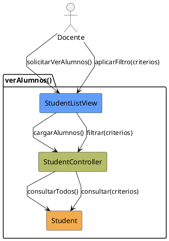

# Jorgestor > CU-23-verAlumnos > Análisis

## información del artefacto

- **Proyecto**: Jorgestor
- **Fase RUP**: Elaboration (Elaboración)
- **Disciplina**: Análisis
- **Versión**: 1.0
- **Fecha**: 2026-05-24
- **Autor**: Equipo de desarrollo

## propósito

Análisis del caso de uso Ver Alumnos. Enfocado en el listado y búsqueda de estudiantes.

## diagrama de colaboración

||
|-|
|Código fuente: [analisis-colaboracion-CU-23-verAlumnos.puml](analisis-colaboracion-CU-23-verAlumnos.puml)|

## clases de análisis identificadas

### clases model (naranja #F2AC4E)
|Clase|Responsabilidad|Trazabilidad|
|-|-|-|
|**Student**|Representa al alumno con sus datos personales|Modelo del dominio|

### clases view (azul #629EF9)
|Clase|Responsabilidad|Derivación|
|-|-|-|
|**StudentListView**|Interfaz para visualizar lista y solicitar filtrado de alumnos|Wireframe|

### clases controller (verde #b5bd68)
|Clase|Responsabilidad|Caso de uso|
|-|-|-|
|**StudentController**|Obtiene colección de alumnos y aplica filtros|verAlumnos()|

## mensajes de colaboración

|Origen|Destino|Mensaje|Intención|
|-|-|-|-|
|**Docente**|**StudentListView**|`solicitarVerAlumnos()`|Iniciar visualización|
|**StudentListView**|**StudentController**|`cargarAlumnos()`|Delegar recuperación|
|**StudentController**|**Student**|`consultarTodos()`|Consultar entidades|
|**Docente**|**StudentListView**|`aplicarFiltro(criterios)`|Solicitar filtrado|
|**StudentListView**|**StudentController**|`filtrar(criterios)`|Procesar criterios|

## trazabilidad con artefactos previos

- **Estados**: `ShowingStudents`, `FilteringStudents`.

