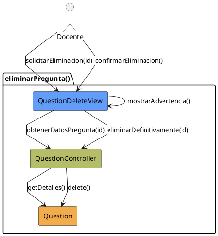

# Jorgestor > CU-25-eliminarPregunta > Análisis

## información del artefacto

- **Proyecto**: Jorgestor
- **Fase RUP**: Elaboration (Elaboración)
- **Disciplina**: Análisis
- **Versión**: 1.0
- **Fecha**: 2026-05-24
- **Autor**: Equipo de desarrollo

## propósito

Análisis del caso de uso Eliminar Pregunta. Sigue el patrón de eliminación segura con confirmación explícita.

## diagrama de colaboración

||
|-|
|Código fuente: [analisis-colaboracion-CU-25-eliminarPregunta.puml](analisis-colaboracion-CU-25-eliminarPregunta.puml)|

## clases de análisis identificadas

### clases model (naranja #F2AC4E)
|Clase|Responsabilidad|Trazabilidad|
|-|-|-|
|**Question**|La entidad que será eliminada del sistema|Modelo del dominio|

### clases view (azul #629EF9)
|Clase|Responsabilidad|Derivación|
|-|-|-|
|**QuestionDeleteView**|Interfaz para visualizar detalles, advertencias y confirmación|Wireframe|

### clases controller (verde #b5bd68)
|Clase|Responsabilidad|Caso de uso|
|-|-|-|
|**QuestionController**|Gestiona el proceso de eliminación lógica o física|eliminarPregunta()|

## mensajes de colaboración

|Origen|Destino|Mensaje|Intención|
|-|-|-|-|
|**Docente**|**QuestionDeleteView**|`solicitarEliminacion(id)`|Iniciar proceso de baja|
|**QuestionDeleteView**|**QuestionController**|`obtenerDatosPregunta(id)`|Delegar recuperación para confirmación|
|**QuestionController**|**Question**|`getDetalles()`|Consultar entidad|
|**QuestionDeleteView**|**QuestionDeleteView**|`mostrarAdvertencia()`|Alertar sobre irreversibilidad|
|**Docente**|**QuestionDeleteView**|`confirmarEliminacion()`|Confirmar acción|
|**QuestionDeleteView**|**QuestionController**|`eliminarDefinitivamente(id)`|Ejecutar la baja|
|**QuestionController**|**Question**|`delete()`|Eliminar del sistema|

## trazabilidad con artefactos previos

- **Seguridad**: Implementa eliminación con confirmación obligatoria.
- **Estados**: `ConfirmingDeletion`, `DeletingQuestion`.

