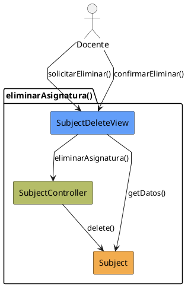

# Jorgestor > CU-26-eliminarAsignatura > Análisis

## información del artefacto

- **Proyecto**: Jorgestor
- **Fase RUP**: Elaboration (Elaboración)
- **Disciplina**: Análisis
- **Versión**: 1.0
- **Fecha**: 2026-05-24
- **Autor**: Equipo de desarrollo

## propósito

Análisis tecnológico agnóstico del caso de uso Eliminar Asignatura, siguiendo la metodología RUP. Permite analizar el flujo y la validación de la baja de una asignatura en el sistema.

## diagrama de colaboración

||
|-|
|Código fuente: [analisis-colaboracion-CU-26-eliminarAsignatura.puml](analisis-colaboracion-CU-26-eliminarAsignatura.puml)|

## clases de análisis identificadas

### clases model (naranja #F2AC4E)
|Clase|Responsabilidad|Trazabilidad|
|-|-|-|
|**Subject**|Entidad que representa la asignatura a eliminar|Modelo del dominio|

### clases view (azul #629EF9)
|Clase|Responsabilidad|Derivación|
|-|-|-|
|**SubjectDeleteView**|Interfaz que permite revisar datos, mostrar advertencias y confirmar la eliminación|Wireframe|

### clases controller (verde #b5bd68)
|Clase|Responsabilidad|Caso de uso|
|-|-|-|
|**SubjectController**|Gestiona la lógica de eliminación, valida restricciones y coordina la baja|eliminarAsignatura()|

## mensajes de colaboración

|Origen|Destino|Mensaje|Intención|
|-|-|-|-|
|**Docente**|**SubjectDeleteView**|`solicitarEliminar()`|Solicitar la eliminación de una asignatura|
|**SubjectDeleteView**|**Subject**|`getDatos()`|Obtener información de la asignatura para mostrar|
|**Docente**|**SubjectDeleteView**|`confirmarEliminar()`|Confirmar la acción de borrado|
|**SubjectDeleteView**|**SubjectController**|`eliminarAsignatura()`|Delegar la eliminación al controlador|
|**SubjectController**|**Subject**|`delete()`|Eliminar físicamente la entidad|

## trazabilidad con artefactos previos

### con especificación detallada
- **Estados internos** �?' `ConfirmingDeletion`, `DeletingSubject`

