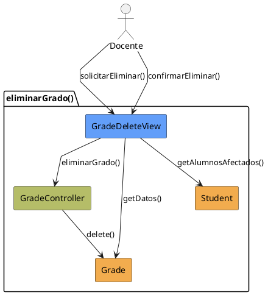

# Jorgestor > CU-27-eliminarGrado > Análisis

## información del artefacto

- **Proyecto**: Jorgestor
- **Fase RUP**: Elaboration (Elaboración)
- **Disciplina**: Análisis
- **Versión**: 1.0
- **Fecha**: 2026-05-24
- **Autor**: Equipo de desarrollo

## propósito

Análisis tecnológico agnóstico del caso de uso Eliminar Grado, siguiendo la metodología RUP. Permite analizar el flujo y la validación de la baja de un grado en el sistema, considerando su impacto en los alumnos.

## diagrama de colaboración

||
|-|
|Código fuente: [analisis-colaboracion-CU-27-eliminarGrado.puml](analisis-colaboracion-CU-27-eliminarGrado.puml)|

## clases de análisis identificadas

### clases model (naranja #F2AC4E)
|Clase|Responsabilidad|Trazabilidad|
|-|-|-|
|**Grade**|Entidad que representa el grado a eliminar|Modelo del dominio|
|**Student**|Entidad relacionada para informar del impacto de la eliminación|Modelo del dominio|

### clases view (azul #629EF9)
|Clase|Responsabilidad|Derivación|
|-|-|-|
|**GradeDeleteView**|Interfaz que permite visualizar información, advertencias y confirmar la eliminación|Wireframe|

### clases controller (verde #b5bd68)
|Clase|Responsabilidad|Caso de uso|
|-|-|-|
|**GradeController**|Gestiona la lógica de eliminación y procesa la baja de la entidad|eliminarGrado()|

## mensajes de colaboración

|Origen|Destino|Mensaje|Intención|
|-|-|-|-|
|**Docente**|**GradeDeleteView**|`solicitarEliminar()`|Solicitar la eliminación de un grado|
|**GradeDeleteView**|**Grade**|`getDatos()`|Obtener información del grado|
|**GradeDeleteView**|**Student**|`getAlumnosAfectados()`|Obtener lista de alumnos que pertenecen al grado|
|**Docente**|**GradeDeleteView**|`confirmarEliminar()`|Confirmar la acción de borrado|
|**GradeDeleteView**|**GradeController**|`eliminarGrado()`|Delegar la eliminación al controlador|
|**GradeController**|**Grade**|`delete()`|Eliminar físicamente la entidad|

## trazabilidad con artefactos previos

### con especificación detallada
- **Estados internos** �?' `ConfirmingDeletion`, `DeletingGrade`

