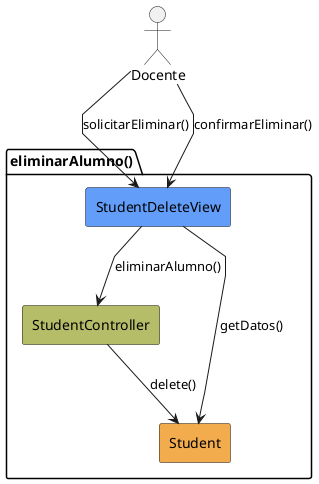

# Jorgestor > CU-28-eliminarAlumno > Análisis

## información del artefacto

- **Proyecto**: Jorgestor
- **Fase RUP**: Elaboration (Elaboración)
- **Disciplina**: Análisis
- **Versión**: 1.0
- **Fecha**: 2026-05-24
- **Autor**: Equipo de desarrollo

## propósito

Análisis tecnológico agnóstico del caso de uso Eliminar Alumno, siguiendo la metodología RUP. Permite analizar el flujo y la validación de la baja de un alumno en el sistema.

## diagrama de colaboración

||
|-|
|Código fuente: [analisis-colaboracion-CU-28-eliminarAlumno.puml](analisis-colaboracion-CU-28-eliminarAlumno.puml)|

## clases de análisis identificadas

### clases model (naranja #F2AC4E)
|Clase|Responsabilidad|Trazabilidad|
|-|-|-|
|**Student**|Entidad que representa al alumno a eliminar|Modelo del dominio|

### clases view (azul #629EF9)
|Clase|Responsabilidad|Derivación|
|-|-|-|
|**StudentDeleteView**|Interfaz que permite revisar datos, mostrar advertencias y confirmar la eliminación|Wireframe|

### clases controller (verde #b5bd68)
|Clase|Responsabilidad|Caso de uso|
|-|-|-|
|**StudentController**|Gestiona la lógica de eliminación y coordina la baja del alumno|eliminarAlumno()|

## mensajes de colaboración

|Origen|Destino|Mensaje|Intención|
|-|-|-|-|
|**Docente**|**StudentDeleteView**|`solicitarEliminar()`|Solicitar la eliminación de un alumno|
|**StudentDeleteView**|**Student**|`getDatos()`|Obtener información del alumno|
|**Docente**|**StudentDeleteView**|`confirmarEliminar()`|Confirmar la acción de borrado|
|**StudentDeleteView**|**StudentController**|`eliminarAlumno()`|Delegar la eliminación al controlador|
|**StudentController**|**Student**|`delete()`|Eliminar físicamente la entidad|

## trazabilidad con artefactos previos

### con especificación detallada
- **Estados internos** → `ConfirmingDeletion`, `DeletingStudent`

