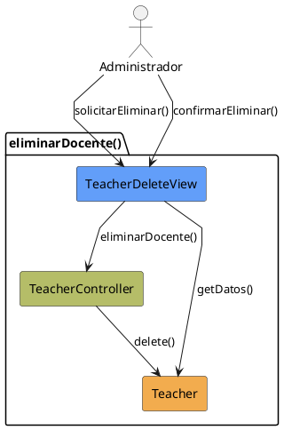

# Jorgestor > CU-29-eliminarDocente > Análisis

## información del artefacto

- **Proyecto**: Jorgestor
- **Fase RUP**: Elaboration (Elaboración)
- **Disciplina**: Análisis
- **Versión**: 1.0
- **Fecha**: 2026-05-24
- **Autor**: Equipo de desarrollo

## propósito

Análisis tecnológico agnóstico del caso de uso Eliminar Docente, siguiendo la metodología RUP. Permite analizar el flujo y la validación de la baja de un docente en el sistema.

## diagrama de colaboración

||
|-|
|Código fuente: [analisis-colaboracion-CU-29-eliminarDocente.puml](analisis-colaboracion-CU-29-eliminarDocente.puml)|

## clases de análisis identificadas

### clases model (naranja #F2AC4E)
|Clase|Responsabilidad|Trazabilidad|
|-|-|-|
|**Teacher**|Entidad docente que se desea eliminar|Modelo del dominio|

### clases view (azul #629EF9)
|Clase|Responsabilidad|Derivación|
|-|-|-|
|**TeacherDeleteView**|Interfaz que permite revisar datos, visualizar advertencias y confirmar la eliminación|Wireframe|

### clases controller (verde #b5bd68)
|Clase|Responsabilidad|Caso de uso|
|-|-|-|
|**TeacherController**|Gestiona la lógica de baja del docente y verifica permisos|eliminarDocente()|

## mensajes de colaboración

|Origen|Destino|Mensaje|Intención|
|-|-|-|-|
|**Administrador**|**TeacherDeleteView**|`solicitarEliminar()`|Solicitar la eliminación de un docente|
|**TeacherDeleteView**|**Teacher**|`getDatos()`|Obtener información del docente|
|**Administrador**|**TeacherDeleteView**|`confirmarEliminar()`|Confirmar la acción de borrado|
|**TeacherDeleteView**|**TeacherController**|`eliminarDocente()`|Delegar la eliminación al controlador|
|**TeacherController**|**Teacher**|`delete()`|Eliminar físicamente la entidad|

## trazabilidad con artefactos previos

### con especificación detallada
- **Estados internos** �?' `ConfirmingDeletion`, `DeletingTeacher`

