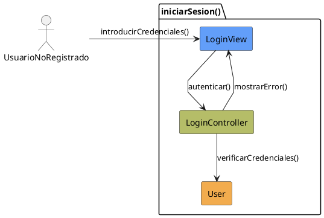

# Jorgestor > CU-30-iniciarSesion > Análisis

> |[🏠️](/Jorgestor/RUP/README.md)|[ 📊](#)|[Detalle](/Jorgestor/RUP/00-casos-uso/02-detalle/CU-30-iniciarSesion/README.md)|**Análisis**|Diseño|Desarrollo|Pruebas|
> |-|-|-|-|-|-|-|

## información del artefacto

- **Proyecto**: Jorgestor
- **Fase RUP**: Elaboration (Elaboración)
- **Disciplina**: Análisis
- **Versión**: 1.0
- **Fecha**: 2026-05-24
- **Autor**: Equipo de desarrollo

## propósito

Análisis tecnológico agnóstico del caso de uso Iniciar Sesión, siguiendo la metodología RUP. Permite analizar el proceso de autenticación de usuarios en el sistema.

## diagrama de colaboración

||
|-|
|Código fuente: [analisis-colaboracion-CU-30-iniciarSesion.puml](analisis-colaboracion-CU-30-iniciarSesion.puml)|

## clases de análisis identificadas

### clases model (naranja #F2AC4E)
|Clase|Responsabilidad|Trazabilidad|
|-|-|-|
|**User**|Representa al usuario con sus credenciales y roles|Modelo del dominio|

### clases view (azul #629EF9)
|Clase|Responsabilidad|Derivación|
|-|-|-|
|**LoginView**|Interfaz para introducir credenciales y mostrar mensajes de error|Wireframe|

### clases controller (verde #b5bd68)
|Clase|Responsabilidad|Caso de uso|
|-|-|-|
|**LoginController**|Gestiona el flujo de autenticación y valida credenciales|iniciarSesion()|

## mensajes de colaboración

|Origen|Destino|Mensaje|Intención|
|-|-|-|-|
|**UsuarioNoRegistrado**|**LoginView**|`introducirCredenciales()`|Proporcionar usuario y contraseña|
|**LoginView**|**LoginController**|`autenticar(user, pass)`|Delegar la validación al controlador|
|**LoginController**|**User**|`verificarCredenciales()`|Comprobar la validez de los datos|
|**LoginController**|**LoginView**|`mostrarError()`|Informar en caso de fallo|
|**LoginController**|**Sistema**|`permitirAcceso()`|Transitar al estado de sistema disponible|

## trazabilidad con artefactos previos

### con especificación detallada
- **Estados internos** → `RequestingAccess`, `ProvidingCredentials`

