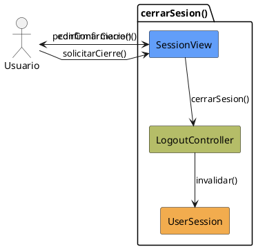

# Jorgestor > CU-31-cerrarSesion > Análisis

## información del artefacto

- **Proyecto**: Jorgestor
- **Fase RUP**: Elaboration (Elaboración)
- **Disciplina**: Análisis
- **Versión**: 1.0
- **Fecha**: 2026-05-24
- **Autor**: Equipo de desarrollo

## propósito

Análisis tecnológico agnóstico del caso de uso Cerrar Sesión, siguiendo la metodología RUP. Permite analizar el proceso de finalización de la sesión de usuario de forma segura.

## diagrama de colaboración

||
|-|
|Código fuente: [analisis-colaboracion-CU-31-cerrarSesion.puml](analisis-colaboracion-CU-31-cerrarSesion.puml)|

## clases de análisis identificadas

### clases model (naranja #F2AC4E)
|Clase|Responsabilidad|Trazabilidad|
|-|-|-|
|**UserSession**|Mantiene el estado de autenticación del usuario|Modelo del dominio|

### clases view (azul #629EF9)
|Clase|Responsabilidad|Derivación|
|-|-|-|
|**SessionView**|Interfaz que permite solicitar el cierre y confirmar la acción|Wireframe|

### clases controller (verde #b5bd68)
|Clase|Responsabilidad|Caso de uso|
|-|-|-|
|**LogoutController**|Gestiona la invalidación de la sesión y la transición de estado|cerrarSesion()|

## mensajes de colaboración

|Origen|Destino|Mensaje|Intención|
|-|-|-|-|
|**Usuario**|**SessionView**|`solicitarCierre()`|Manifestar la intención de salir|
|**SessionView**|**Usuario**|`pedirConfirmacion()`|Solicitar validación final|
|**Usuario**|**SessionView**|`confirmarCierre()`|Aceptar el cierre de sesión|
|**SessionView**|**LogoutController**|`cerrarSesion()`|Delegar la invalidación de la sesión|
|**LogoutController**|**UserSession**|`invalidar()`|Eliminar el estado de autenticación|

## trazabilidad con artefactos previos

### con especificación detallada
- **Estados internos** �?' `SolicitandoCierre`, `ConfirmandoCierre`

