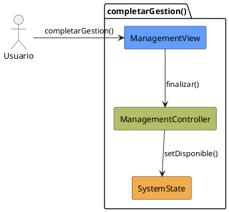

# Jorgestor > CU-32-completarGestion > Análisis

## información del artefacto

- **Proyecto**: Jorgestor
- **Fase RUP**: Elaboration (Elaboración)
- **Disciplina**: Análisis
- **Versión**: 1.0
- **Fecha**: 2026-05-24
- **Autor**: Equipo de desarrollo

## propósito

Análisis tecnológico agnóstico del caso de uso Completar Gestión, siguiendo la metodología RUP. Permite analizar la transición desde estados de gestión hacia la disponibilidad general del sistema.

## diagrama de colaboración

||
|-|
|Código fuente: [analisis-colaboracion-CU-32-completarGestion.puml](analisis-colaboracion-CU-32-completarGestion.puml)|

## clases de análisis identificadas

### clases model (naranja #F2AC4E)
|Clase|Responsabilidad|Trazabilidad|
|-|-|-|
|**SystemState**|Representa el estado global y la navegación del sistema|Modelo del dominio|

### clases view (azul #629EF9)
|Clase|Responsabilidad|Derivación|
|-|-|-|
|**ManagementView**|Interfaz común para áreas de gestión que permite finalizar la operación|Wireframe|

### clases controller (verde #b5bd68)
|Clase|Responsabilidad|Caso de uso|
|-|-|-|
|**ManagementController**|Gestiona la transición de estado y asegura el procesado de cambios|completarGestion()|

## mensajes de colaboración

|Origen|Destino|Mensaje|Intención|
|-|-|-|-|
|**Usuario**|**ManagementView**|`completarGestion()`|Solicitar la finalización de la gestión actual|
|**ManagementView**|**ManagementController**|`finalizar()`|Coordinar el retorno al estado de disponibilidad|
|**ManagementController**|**SystemState**|`setDisponible()`|Actualizar el estado global del sistema|

## trazabilidad con artefactos previos

### con especificación detallada
- **Estados internos** → `PresentandoOpciones`

