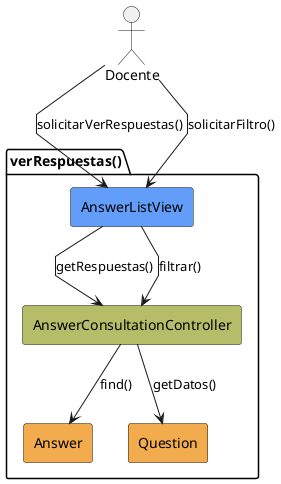

# Jorgestor > CU-33-verRespuestas > Análisis

> |[🏠️](/Jorgestor/RUP/README.md)|[ 📊](#)|[Detalle](/Jorgestor/RUP/00-casos-uso/02-detalle/CU-33-verRespuestas/README.md)|**Análisis**|Diseño|Desarrollo|Pruebas|
> |-|-|-|-|-|-|-|

## información del artefacto

- **Proyecto**: Jorgestor
- **Fase RUP**: Elaboration (Elaboración)
- **Disciplina**: Análisis
- **Versión**: 1.0
- **Fecha**: 2026-05-24
- **Autor**: Equipo de desarrollo

## propósito

Análisis tecnológico agnóstico del caso de uso Ver Respuestas, siguiendo la metodología RUP. Permite analizar la lógica de visualización y filtrado de las respuestas asociadas a una pregunta.

## diagrama de colaboración

||
|-|
|Código fuente: [analisis-colaboracion-CU-33-verRespuestas.puml](analisis-colaboracion-CU-33-verRespuestas.puml)|

## clases de análisis identificadas

### clases model (naranja #F2AC4E)
|Clase|Responsabilidad|Trazabilidad|
|-|-|-|
|**Answer**|Representa una respuesta con su contenido y veracidad|Modelo del dominio|
|**Question**|Representa la pregunta a la que pertenecen las respuestas|Modelo del dominio|

### clases view (azul #629EF9)
|Clase|Responsabilidad|Derivación|
|-|-|-|
|**AnswerListView**|Interfaz que muestra la lista de respuestas y permite filtrar|Wireframe|

### clases controller (verde #b5bd68)
|Clase|Responsabilidad|Caso de uso|
|-|-|-|
|**AnswerConsultationController**|Gestiona la recuperación y el filtrado de respuestas|verRespuestas()|

## mensajes de colaboración

|Origen|Destino|Mensaje|Intención|
|-|-|-|-|
|**Docente**|**AnswerListView**|`solicitarVerRespuestas()`|Solicitar la lista de respuestas|
|**AnswerListView**|**AnswerConsultationController**|`getRespuestas(question)`|Recuperar respuestas de la entidad|
|**AnswerConsultationController**|**Answer**|`find(question)`|Consultar entidades vinculadas|
|**AnswerListView**|**Docente**|`mostrarLista()`|Presentar las respuestas al usuario|
|**Docente**|**AnswerListView**|`solicitarFiltro()`|Aplicar criterios de filtrado|
|**AnswerListView**|**AnswerConsultationController**|`filtrar(criterios)`|Procesar el filtro solicitado|

## trazabilidad con artefactos previos

### con especificación detallada
- **Estados internos** → `MostrandoRespuestas`, `FiltrandoRespuestas`

