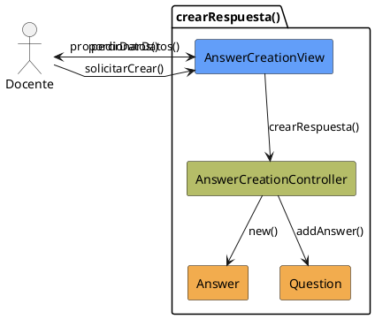

# Jorgestor > CU-34-crearRespuesta > Análisis

> |[🏠️](/Jorgestor/RUP/README.md)|[ 📊](#)|[Detalle](/Jorgestor/RUP/00-casos-uso/02-detalle/CU-34-crearRespuesta/README.md)|**Análisis**|Diseño|Desarrollo|Pruebas|
> |-|-|-|-|-|-|-|

## información del artefacto

- **Proyecto**: Jorgestor
- **Fase RUP**: Elaboration (Elaboración)
- **Disciplina**: Análisis
- **Versión**: 1.0
- **Fecha**: 2026-05-24
- **Autor**: Equipo de desarrollo

## propósito

Análisis tecnológico agnóstico del caso de uso Crear Respuesta, siguiendo la metodología RUP. Permite analizar el proceso de alta de una nueva respuesta vinculada a una pregunta.

## diagrama de colaboración

||
|-|
|Código fuente: [analisis-colaboracion-CU-34-crearRespuesta.puml](analisis-colaboracion-CU-34-crearRespuesta.puml)|

## clases de análisis identificadas

### clases model (naranja #F2AC4E)
|Clase|Responsabilidad|Trazabilidad|
|-|-|-|
|**Answer**|Entidad que almacena el contenido y validez de la respuesta|Modelo del dominio|
|**Question**|Entidad a la que se asocia la nueva respuesta|Modelo del dominio|

### clases view (azul #629EF9)
|Clase|Responsabilidad|Derivación|
|-|-|-|
|**AnswerCreationView**|Interfaz para introducir datos mínimos y confirmar la creación|Wireframe|

### clases controller (verde #b5bd68)
|Clase|Responsabilidad|Caso de uso|
|-|-|-|
|**AnswerCreationController**|Valida datos y coordina la creación de la entidad|crearRespuesta()|

## mensajes de colaboración

|Origen|Destino|Mensaje|Intención|
|-|-|-|-|
|**Docente**|**AnswerCreationView**|`solicitarCrear()`|Manifestar intención de crear respuesta|
|**AnswerCreationView**|**Docente**|`pedirDatos()`|Solicitar contenido y veracidad|
|**Docente**|**AnswerCreationView**|`proporcionarDatos()`|Introducir la información requerida|
|**AnswerCreationView**|**AnswerCreationController**|`crearRespuesta(datos)`|Delegar la lógica de creación|
|**AnswerCreationController**|**Answer**|`new()`|Instanciar la nueva entidad|
|**AnswerCreationController**|**Question**|`addAnswer(answer)`|Vincular la respuesta a la pregunta|

## trazabilidad con artefactos previos

### con especificación detallada
- **Estados internos** → `SolicitandoDatosRespuesta`, `ProcesandoCreacion`

