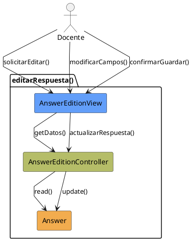

# Jorgestor > CU-35-editarRespuesta > Análisis

## información del artefacto

- **Proyecto**: Jorgestor
- **Fase RUP**: Elaboration (Elaboración)
- **Disciplina**: Análisis
- **Versión**: 1.0
- **Fecha**: 2026-05-24
- **Autor**: Equipo de desarrollo

## propósito

Análisis tecnológico agnóstico del caso de uso Editar Respuesta, siguiendo la metodología RUP. Permite analizar el proceso de modificación de una respuesta existente.

## diagrama de colaboración

||
|-|
|Código fuente: [analisis-colaboracion-CU-35-editarRespuesta.puml](analisis-colaboracion-CU-35-editarRespuesta.puml)|

## clases de análisis identificadas

### clases model (naranja #F2AC4E)
|Clase|Responsabilidad|Trazabilidad|
|-|-|-|
|**Answer**|Entidad que contiene la información de la respuesta a editar|Modelo del dominio|

### clases view (azul #629EF9)
|Clase|Responsabilidad|Derivación|
|-|-|-|
|**AnswerEditionView**|Interfaz para visualizar y modificar datos de la respuesta|Wireframe|

### clases controller (verde #b5bd68)
|Clase|Responsabilidad|Caso de uso|
|-|-|-|
|**AnswerEditionController**|Gestiona la carga, validación y persistencia de cambios|editarRespuesta()|

## mensajes de colaboración

|Origen|Destino|Mensaje|Intención|
|-|-|-|-|
|**Docente**|**AnswerEditionView**|`solicitarEditar()`|Iniciar la edición de una respuesta|
|**AnswerEditionView**|**AnswerEditionController**|`getDatos(answer)`|Recuperar información actual|
|**AnswerEditionController**|**Answer**|`read()`|Consultar el estado de la entidad|
|**Docente**|**AnswerEditionView**|`modificarCampos()`|Introducir cambios en la interfaz|
|**Docente**|**AnswerEditionView**|`confirmarGuardar()`|Solicitar la persistencia de cambios|
|**AnswerEditionView**|**AnswerEditionController**|`actualizarRespuesta(datos)`|Coordinar la actualización|
|**AnswerEditionController**|**Answer**|`update()`|Persistir las modificaciones|

## trazabilidad con artefactos previos

### con especificación detallada
- **Estados internos** �?' `EditandoDatos`, `GuardandoDatos`

