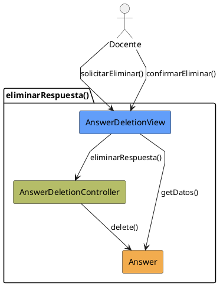

# Jorgestor > CU-36-eliminarRespuesta > Análisis

> |[🏠️](/Jorgestor/RUP/README.md)|[ 📊](#)|[Detalle](/Jorgestor/RUP/00-casos-uso/02-detalle/CU-36-eliminarRespuesta/README.md)|**Análisis**|Diseño|Desarrollo|Pruebas|
> |-|-|-|-|-|-|-|

## información del artefacto

- **Proyecto**: Jorgestor
- **Fase RUP**: Elaboration (Elaboración)
- **Disciplina**: Análisis
- **Versión**: 1.0
- **Fecha**: 2026-05-24
- **Autor**: Equipo de desarrollo

## propósito

Análisis tecnológico agnóstico del caso de uso Eliminar Respuesta, siguiendo la metodología RUP. Permite analizar el flujo de confirmación y baja definitiva de una respuesta del sistema.

## diagrama de colaboración

||
|-|
|Código fuente: [colaboracion.puml](colaboracion.puml)|

## clases de análisis identificadas

### clases model (naranja #F2AC4E)
|Clase|Responsabilidad|Trazabilidad|
|-|-|-|
|**Answer**|Entidad que será eliminada del sistema|Modelo del dominio|

### clases view (azul #629EF9)
|Clase|Responsabilidad|Derivación|
|-|-|-|
|**AnswerDeletionView**|Interfaz que muestra información de la respuesta y solicita confirmación|Wireframe|

### clases controller (verde #b5bd68)
|Clase|Responsabilidad|Caso de uso|
|-|-|-|
|**AnswerDeletionController**|Valida la posibilidad de borrado y coordina la eliminación|eliminarRespuesta()|

## mensajes de colaboración

|Origen|Destino|Mensaje|Intención|
|-|-|-|-|
|**Docente**|**AnswerDeletionView**|`solicitarEliminar()`|Iniciar el flujo de borrado|
|**AnswerDeletionView**|**Answer**|`getDatos()`|Obtener detalles para mostrar advertencia|
|**Docente**|**AnswerDeletionView**|`confirmarEliminar()`|Validar la acción definitiva|
|**AnswerDeletionView**|**AnswerDeletionController**|`eliminarRespuesta(answer)`|Delegar la ejecución de la baja|
|**AnswerDeletionController**|**Answer**|`delete()`|Eliminar físicamente la entidad|

## trazabilidad con artefactos previos

### con especificación detallada
- **Estados internos** → `ConfirmandoEliminacion`, `EliminandoRespuesta`

