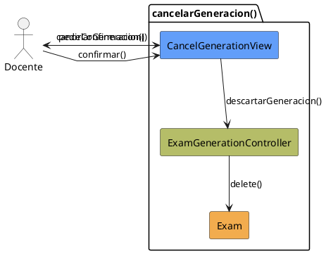

# Jorgestor > CU-37-cancelarGeneracion > Análisis

> |[🏠️](/Jorgestor/RUP/README.md)|[ 📊](#)|[Detalle](/Jorgestor/RUP/00-casos-uso/02-detalle/CU-37-cancelarGeneracion/README.md)|**Análisis**|Diseño|Desarrollo|Pruebas|
> |-|-|-|-|-|-|-|

## información del artefacto

- **Proyecto**: Jorgestor
- **Fase RUP**: Elaboration (Elaboración)
- **Disciplina**: Análisis
- **Versión**: 1.0
- **Fecha**: 2026-05-24
- **Autor**: Equipo de desarrollo

## propósito

Análisis tecnológico agnóstico del caso de uso Cancelar Generación, siguiendo la metodología RUP. Permite analizar el proceso de abortar la generación de exámenes y asegurar la consistencia del sistema.

## diagrama de colaboración

||
|-|
|Código fuente: [analisis-colaboracion-CU-37-cancelarGeneracion.puml](analisis-colaboracion-CU-37-cancelarGeneracion.puml)|

## clases de análisis identificadas

### clases model (naranja #F2AC4E)
|Clase|Responsabilidad|Trazabilidad|
|-|-|-|
|**Exam**|Instancias temporales de exámenes generados a descartar|Modelo del dominio|

### clases view (azul #629EF9)
|Clase|Responsabilidad|Derivación|
|-|-|-|
|**CancelGenerationView**|Interfaz que solicita confirmación al docente para cancelar|Wireframe|

### clases controller (verde #b5bd68)
|Clase|Responsabilidad|Caso de uso|
|-|-|-|
|**ExamGenerationController**|Gestiona la lógica de cancelación y descarte de datos temporales|cancelarGeneracion()|

## mensajes de colaboración

|Origen|Destino|Mensaje|Intención|
|-|-|-|-|
|**Docente**|**CancelGenerationView**|`cancelarGeneracion()`|Solicitar abortar el proceso actual|
|**CancelGenerationView**|**Docente**|`pedirConfirmacion()`|Asegurar la intención del usuario|
|**Docente**|**CancelGenerationView**|`confirmar()`|Validar la cancelación definitiva|
|**CancelGenerationView**|**ExamGenerationController**|`descartarGeneracion()`|Coordinar la eliminación de temporales|
|**ExamGenerationController**|**Exam**|`delete()`|Eliminar las instancias de examen creadas|

## trazabilidad con artefactos previos

### con especificación detallada
- **Decisiones** → La cancelación implica la eliminación de instancias temporales de `Exam`.

