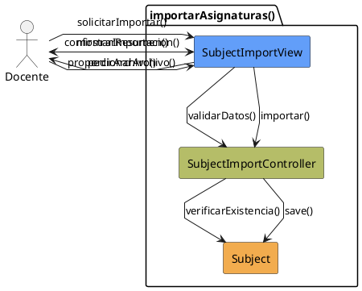

# Jorgestor > CU-38-importarAsignaturas > Análisis

> |[🏠️](/Jorgestor/RUP/README.md)|[ 📊](#)|[Detalle](/Jorgestor/RUP/00-casos-uso/02-detalle/CU-38-importarAsignaturas/README.md)|**Análisis**|Diseño|Desarrollo|Pruebas|
> |-|-|-|-|-|-|-|

## información del artefacto

- **Proyecto**: Jorgestor
- **Fase RUP**: Elaboration (Elaboración)
- **Disciplina**: Análisis
- **Versión**: 1.0
- **Fecha**: 2026-05-24
- **Autor**: Equipo de desarrollo

## propósito

Análisis tecnológico agnóstico del caso de uso Importar Asignaturas, siguiendo la metodología RUP. Permite analizar el flujo de integración masiva de asignaturas desde archivos externos.

## diagrama de colaboración

||
|-|
|Código fuente: [analisis-colaboracion-CU-38-importarAsignaturas.puml](analisis-colaboracion-CU-38-importarAsignaturas.puml)|

## clases de análisis identificadas

### clases model (naranja #F2AC4E)
|Clase|Responsabilidad|Trazabilidad|
|-|-|-|
|**Subject**|Entidad asignatura que será creada o actualizada|Modelo del dominio|

### clases view (azul #629EF9)
|Clase|Responsabilidad|Derivación|
|-|-|-|
|**SubjectImportView**|Interfaz para selección de archivo, previsualización y confirmación|Wireframe|

### clases controller (verde #b5bd68)
|Clase|Responsabilidad|Caso de uso|
|-|-|-|
|**SubjectImportController**|Gestiona la validación de datos, control de duplicados y persistencia|importarAsignaturas()|

## mensajes de colaboración

|Origen|Destino|Mensaje|Intención|
|-|-|-|-|
|**Docente**|**SubjectImportView**|`solicitarImportar()`|Iniciar el proceso de importación|
|**SubjectImportView**|**Docente**|`pedirArchivo()`|Solicitar el origen de los datos|
|**Docente**|**SubjectImportView**|`proporcionarArchivo()`|Entregar el archivo para procesar|
|**SubjectImportView**|**SubjectImportController**|`validarDatos(archivo)`|Delegar la validación y análisis|
|**SubjectImportController**|**Subject**|`verificarExistencia()`|Comprobar si ya existen las asignaturas|
|**SubjectImportView**|**Docente**|`mostrarResumen()`|Presentar resultados de la validación|
|**Docente**|**SubjectImportView**|`confirmarImportacion()`|Validar la carga definitiva|
|**SubjectImportView**|**SubjectImportController**|`importar()`|Coordinar la persistencia masiva|
|**SubjectImportController**|**Subject**|`save()`|Persistir las nuevas entidades|

## trazabilidad con artefactos previos

### con especificación detallada
- **Decisiones** → Se sigue el patrón de importación consistente con el resto de entidades.

