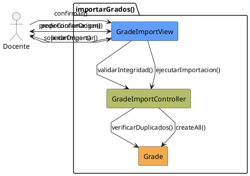

# Jorgestor > CU-39-importarGrados > Análisis

> |[🏠️](/Jorgestor/RUP/README.md)|[ 📊](#)|[Detalle](/Jorgestor/RUP/00-casos-uso/02-detalle/CU-39-importarGrados/README.md)|**Análisis**|Diseño|Desarrollo|Pruebas|
> |-|-|-|-|-|-|-|

## información del artefacto

- **Proyecto**: Jorgestor
- **Fase RUP**: Elaboration (Elaboración)
- **Disciplina**: Análisis
- **Versión**: 1.0
- **Fecha**: 2026-05-24
- **Autor**: Equipo de desarrollo

## propósito

Análisis tecnológico agnóstico del caso de uso Importar Grados, siguiendo la metodología RUP. Permite analizar el flujo de carga masiva de grados académicos desde fuentes externas.

## diagrama de colaboración

||
|-|
|Código fuente: [colaboracion.puml](colaboracion.puml)|

## clases de análisis identificadas

### clases model (naranja #F2AC4E)
|Clase|Responsabilidad|Trazabilidad|
|-|-|-|
|**Grade**|Entidad grado que será creada en el sistema|Modelo del dominio|

### clases view (azul #629EF9)
|Clase|Responsabilidad|Derivación|
|-|-|-|
|**GradeImportView**|Interfaz para gestión de carga de archivo y confirmación de la operación|Wireframe|

### clases controller (verde #b5bd68)
|Clase|Responsabilidad|Caso de uso|
|-|-|-|
|**GradeImportController**|Valida la integridad de los datos y gestiona el alta masiva|importarGrados()|

## mensajes de colaboración

|Origen|Destino|Mensaje|Intención|
|-|-|-|-|
|**Docente**|**GradeImportView**|`solicitarImportar()`|Iniciar el proceso de importación de grados|
|**GradeImportView**|**Docente**|`pedirOrigen()`|Solicitar la fuente de datos|
|**Docente**|**GradeImportView**|`proporcionarOrigen()`|Entregar la información para procesar|
|**GradeImportView**|**GradeImportController**|`validarIntegridad(datos)`|Delegar la validación técnica|
|**GradeImportController**|**Grade**|`verificarDuplicados()`|Asegurar la consistencia de los datos|
|**GradeImportView**|**Docente**|`pedirConfirmacion()`|Solicitar validación final del usuario|
|**Docente**|**GradeImportView**|`confirmar()`|Aceptar la carga masiva|
|**GradeImportView**|**GradeImportController**|`ejecutarImportacion()`|Coordinar el guardado de entidades|
|**GradeImportController**|**Grade**|`createAll()`|Persistir todos los nuevos grados|

## trazabilidad con artefactos previos

### con especificación detallada
- **Decisiones** → Mantiene coherencia con el flujo de importación global centrado en `Grade`.

