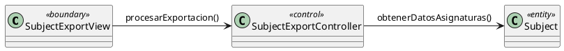

# Jorgestor > exportarAsignaturas > Análisis

## Propósito
Análisis del caso de uso `exportarAsignaturas()` mediante diagrama de colaboración MVC, identificando clases de análisis y sus interacciones.

## diagrama de colaboración

||
|-|
|Código fuente: [analisis-colaboracion-CU-40-exportarAsignaturas.puml](analisis-colaboracion-CU-40-exportarAsignaturas.puml)|

## Clases de Análisis Identificadas

### Clases Model (Entidad)
| Clase | Responsabilidad |
|-------|-----------------|
| **Subject** | Entidad que representa la asignatura a exportar. |

### Clases View (Frontera)
| Clase | Responsabilidad |
|-------|-----------------|
| **SubjectExportView** | Interfaz para configurar la exportación de asignaturas. |

### Clases Controller (Control)
| Clase | Responsabilidad |
|-------|-----------------|
| **SubjectExportController** | Orquesta la recopilación de datos y generación del archivo. |

## Mensajes de Colaboración
| Origen | Destino | Mensaje | Intención |
|--------|---------|---------|-----------|
| **Docente** | **SubjectExportView** | `exportarAsignaturas()` | Iniciar proceso de exportación. |
| **SubjectExportView** | **SubjectExportController** | `procesarExportacion()` | Delegar la lógica de exportación. |
| **SubjectExportController** | **Subject** | `obtenerDatosAsignaturas()` | Recopilar información de las entidades. |

