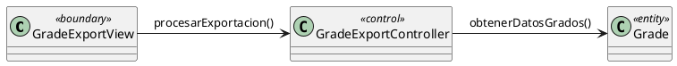

# Jorgestor > exportarGrados > Análisis

## Propósito
Análisis del caso de uso `exportarGrados()` mediante diagrama de colaboración MVC.

## diagrama de colaboración

||
|-|
|Código fuente: [analisis-colaboracion-CU-41-exportarGrados.puml](analisis-colaboracion-CU-41-exportarGrados.puml)|

## Clases de Análisis Identificadas

### Clases Model (Entidad)
| Clase | Responsabilidad |
|-------|-----------------|
| **Grade** | Entidad que representa el grado a exportar. |

### Clases View (Frontera)
| Clase | Responsabilidad |
|-------|-----------------|
| **GradeExportView** | Interfaz para la gestión de la exportación de grados. |

### Clases Controller (Control)
| Clase | Responsabilidad |
|-------|-----------------|
| **GradeExportController** | Gestiona la recopilación de datos y preparación del archivo. |

## Mensajes de Colaboración
| Origen | Destino | Mensaje | Intención |
|--------|---------|---------|-----------|
| **Docente** | **GradeExportView** | `exportarGrados()` | Iniciar proceso de exportación. |
| **GradeExportView** | **GradeExportController** | `procesarExportacion()` | Delegar la lógica de exportación. |
| **GradeExportController** | **Grade** | `obtenerDatosGrados()` | Recopilar información de las entidades. |

