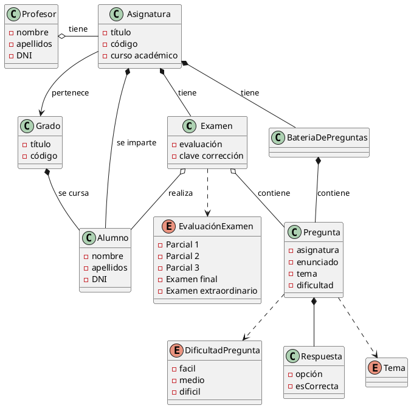
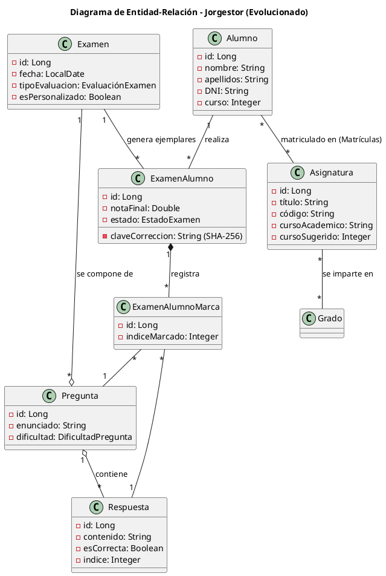
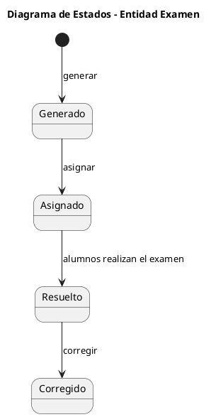
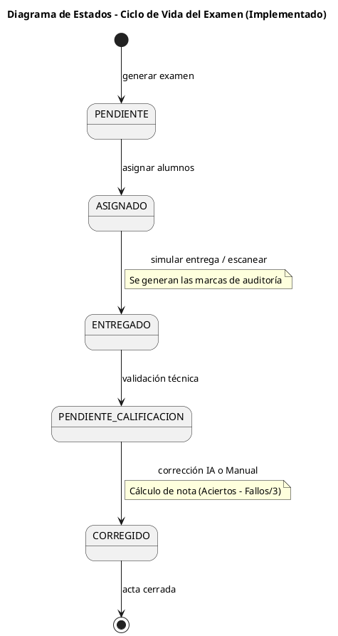

# 📈 Evolución del Análisis y Diseño (RUP)

Este documento muestra la maduración del sistema **Jorgestor**, comparando el modelado inicial (teórico) con la arquitectura final implementada para satisfacer los requisitos de realismo académico.

---

## 1. Modelo de Datos (Diagrama Entidad-Relación)

### 🔴 Estado Inicial (Modelado)
El diseño original contemplaba relaciones simples 1:N y campos básicos de identificación.

### 🟢 Estado Final (Implementado)
Se ha evolucionado a una arquitectura **N:M** para soportar asignaturas transversales y matriculaciones complejas, añadiendo además la trazabilidad de auditoría.

---

## 2. Ciclo de Vida del Examen (Diagrama de Estados)

### 🔴 Estado Inicial (Modelado)
Flujo lineal simplificado sin fases de auditoría técnica.

### 🟢 Estado Final (Implementado)
Flujo detallado que soporta la simulación de entrega y la validación previa a la calificación final.

---
*Este documento demuestra la capacidad del equipo para aplicar un Diseño Evolutivo (JEDUF) manteniendo la trazabilidad con los requisitos originales.*
